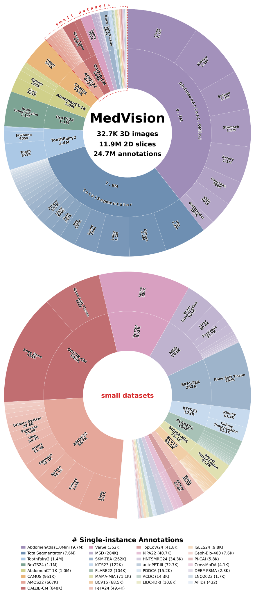
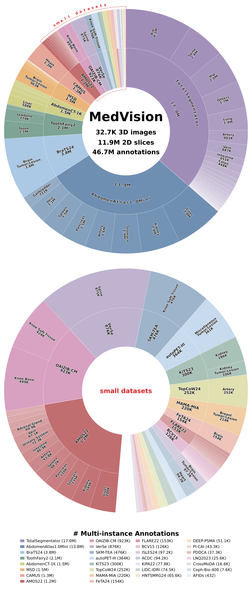
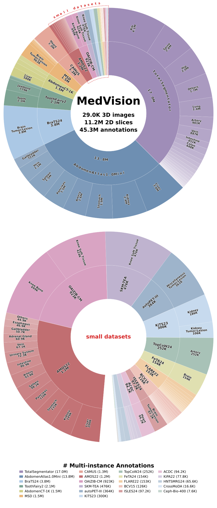
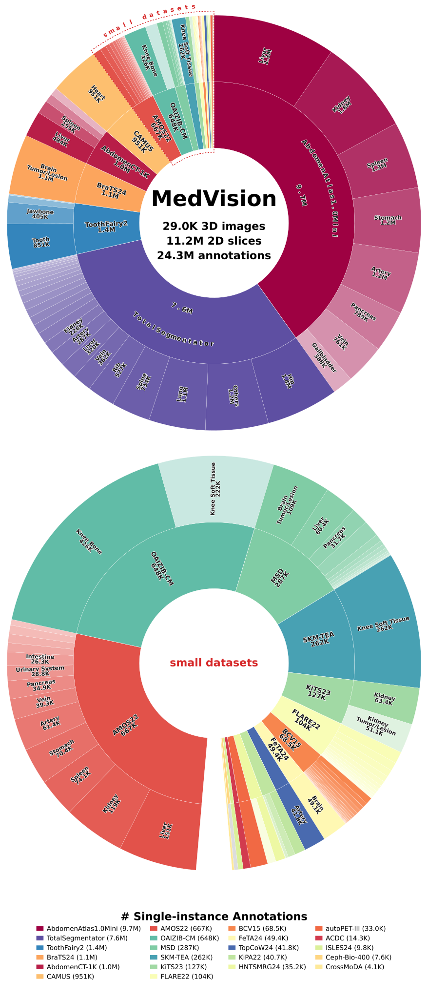
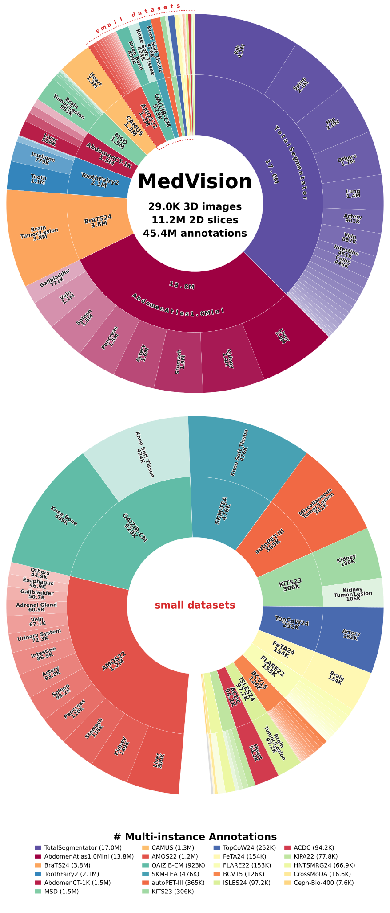
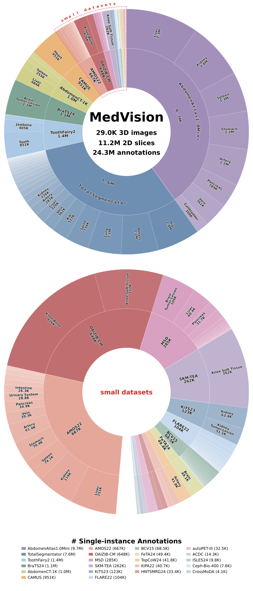

<div align="center">
  <picture>
    <source media="(prefers-color-scheme: dark)" srcset="fig/medvision-logo-dark.svg">
    
  </picture><br>

  # Dataset and Benchmark for *Quantitative* Medical Image Analysis

  | 🌏 [**Project**](https://medvision-vlm.github.io) | 🧑🏻‍💻 [**GitHub**](https://github.com/YongchengYAO/MedVision) | 📚 [**Docs**](https://medvision.readthedocs.io/en/latest/index.html) | 🩻 [**Dataset**](https://huggingface.co/datasets/YongchengYAO/MedVision) | 🔎 [**Data Explorer**](https://medvision-vlm.github.io/explorer.html) | 🐳 [**Docker**](https://hub.docker.com/r/vincentycyao/medvision/tags) | 🤗 [**Models**](https://huggingface.co/collections/YongchengYAO/medvision-v0) | 🚀 [**Demo**](https://huggingface.co/spaces/YongchengYAO/MedVision-V0-demo) | 📖 [**arXiv**](https://arxiv.org/abs/2511.18676) | 💼 [**LinkedIn**](https://www.linkedin.com/in/yongcheng-yao-379b44279) |

  🔎 Benchmarking VLMs for medical vision tasks: detection and measurement 📏

  💿 32.7K 3D images | 11.9M 2D slices | 24.7M single-instance / 46.7M multi-instance annotations | multi-modality | multi-anatomy 💿

  📏 Annotation: segmentation mask | landmark coordinate | bounding box | tumor/lesion size | distance | angle 📏

  🎯 Post-training: SFT, RFT (RL), CoT, LoRA | Framework: TRL, verl 🎯

</div>


```
@misc{yao2026medvisionbenchmarkingquantitativemedical,
      title={MedVision: Benchmarking Quantitative Medical Image Analysis}, 
      author={Yongcheng Yao and Yongshuo Zong and Raman Dutt and Yongxin Yang and Sotirios A Tsaftaris and Timothy Hospedales},
      year={2026},
      eprint={2511.18676},
      archivePrefix={arXiv},
      primaryClass={cs.CV},
      url={https://arxiv.org/abs/2511.18676}, 
}
```

<br/>

# 🏆 Benchmarked Models

MedVision benchmarks **19 vision–language models** — open-weight general-purpose and medical VLMs plus proprietary API models — on detection, tumor/lesion size, and angle/distance measurement. The live **open leaderboard** (per-task score tables + a **frontier API-model pilot study**) lives on the [**project page**](https://medvision-vlm.github.io).

#### Ours

<p align="left">
<b><a href="https://huggingface.co/YongchengYAO/MedVision-V0-7B">MedVision-V0</a></b>
</p>

#### General-purpose VLMs (open-weight)

<p align="left">
 <a href="https://huggingface.co/Qwen/Qwen2.5-VL-7B-Instruct">Qwen2.5-VL</a>, <a href="https://huggingface.co/Qwen/Qwen3-VL-32B-Thinking">Qwen3-VL-Thinking</a> &nbsp;·&nbsp;  <a href="https://huggingface.co/OpenGVLab/InternVL3-38B">InternVL3</a> &nbsp;·&nbsp;  <a href="https://huggingface.co/google/gemma-3-27b-it">Gemma-3</a>, <a href="https://huggingface.co/google/gemma-4-31B-it">Gemma-4</a> &nbsp;·&nbsp;  <a href="https://huggingface.co/meta-llama/Llama-3.2-11B-Vision-Instruct">Llama-3.2-Vision</a> &nbsp;·&nbsp; <a href="https://huggingface.co/llava-hf/llava-onevision-qwen2-72b-ov-hf">LLaVA-OneVision</a> &nbsp;·&nbsp;  <a href="https://huggingface.co/zai-org/GLM-4.6V">GLM-4.6V</a>, <a href="https://huggingface.co/zai-org/GLM-4.6V-Flash">GLM-4.6V-Flash</a>
</p>

#### Medical VLMs (open-weight)

<p align="left">
 <a href="https://huggingface.co/google/medgemma-4b-it">MedGemma</a> &nbsp;·&nbsp; <a href="https://huggingface.co/microsoft/llava-med-v1.5-mistral-7b">LLaVA-Med</a>, <a href="https://huggingface.co/lingshu-medical-mllm/Lingshu-32B">Lingshu</a>, <a href="https://huggingface.co/Sunanhe/MedDr_0401">MedDr</a>, <a href="https://huggingface.co/FreedomIntelligence/HuatuoGPT-Vision-34B">HuatuoGPT-Vision</a>, <a href="https://huggingface.co/lintw/HealthGPT-L14">HealthGPT-L14</a>
</p>

#### Proprietary / API

<p align="left">
 Claude-Fable-5 &nbsp;·&nbsp; <picture><source media="(prefers-color-scheme: dark)" srcset="https://cdn.jsdelivr.net/npm/@lobehub/icons-static-png@1.91.0/dark/openai.png"></picture> GPT-5.5-Pro &nbsp;·&nbsp;  Gemini-3.1-Pro &nbsp;·&nbsp;  Kimi-K2.6
</p>

> The project-page leaderboard currently publishes full score tables for the 12 off-the-shelf VLMs + MedVision-V0, plus a Claude-Fable-5 / Gemini-3.1-Pro API pilot on tumor/lesion size. Newer entries (Qwen3-VL-Thinking, Gemma-4, GLM-4.6V/-Flash, GPT-5.5-Pro, Kimi-K2.6) have eval scripts wired up and are being rolled into the leaderboard.

<br/>

# 🔥 News

- [Aug 3, 2026] 🚀 Release **MedVision** dataset v1.2.1 [[release-v1.2.1]](https://huggingface.co/datasets/YongchengYAO/MedVision/blob/main/doc/release-v1.2.1.md)
  - ⚠️ **Corrects MAMA-MIA and PI-CAI, whose v1.2.0 annotations were recorded in the source orientation** instead of RAS+ — the loader reoriented the images at load time without renumbering the coordinates. Their v1.2.0 annotations are **withdrawn**. If you have used either dataset, [clear that cache once](https://huggingface.co/datasets/YongchengYAO/MedVision/blob/main/doc/release-v1.2.1.md#do-i-need-to-do-anything).
  - **No other dataset is affected** — the other 28 resolve to exactly the same annotation files as at v1.2.0.
  - New: [`scripts/gen-annotations/`](https://huggingface.co/datasets/YongchengYAO/MedVision/blob/main/scripts/gen-annotations/README.md) rebuilds the preprocessed images and annotations of any dataset from its original source, and the annotation version is now an explicit `--annotation_version` input rather than a side effect of the installed package version -- For the record only, you never use it to load data.

- [Jul 28, 2026] 🚀 Release **MedVision** dataset v1.2.0 [[release-v1.2.0]](https://huggingface.co/datasets/YongchengYAO/MedVision/blob/main/doc/release-v1.2.0.md)
  - Highlight: 8 new datasets (130 configs) — AFIDs, DEEP-PSMA, LIDC-IDRI, LNQ2023, MAMA-MIA, PDDCA, PI-CAI, VerSe.
  - **No existing annotation changed.** Annotation versions now resolve per dataset: the version you set is a *ceiling*, and each dataset loads the newest annotation it published at or before it. Pinning `'1.1.1'` or older keeps working for every pre-existing dataset (check [Annotation Version Control](https://medvision-vlm.github.io/explorer.html)).
  - ⚠️ **Fixes a stale-cache defect present in all earlier versions.** The cache key used the version you *requested* rather than the annotation actually loaded, so `load_dataset` could silently return previously cached rows after the annotations changed — which really happened, to the v1.1.0 T/L train/test split. See [Fixed: cached data could be stale](https://huggingface.co/datasets/YongchengYAO/MedVision/blob/main/doc/release-v1.2.0.md#fixed-cached-data-could-be-stale) for who is affected and how to clear it. The data root is now part of the key too, which matters only if your HuggingFace cache is not already co-located with it. Because the cache key changed, **existing Arrow caches rebuild once** on next use (reads the annotation file, no re-download)
- [Jul 21, 2026] Updated [leaderboard](https://medvision-vlm.github.io/) and [data explorer](https://medvision-vlm.github.io/explorer.html) 
- [Jul 4, 2026] Released the benchmarking/fine-tuning codebase `medvision_bm` v1.1.1 — [release notes](https://github.com/YongchengYAO/MedVision/blob/master/docs/codebase-release/release-v1.1.1.md)
  - 📚 New [documentation site](https://medvision.readthedocs.io/en/latest/index.html) on Read the Docs: installation, dataset, benchmarking, and fine-tuning guides plus the full CLI and Python API reference.
- [Jun 29, 2026] 🚀 Released the **MedVision** dataset (`medvision_ds`) v1.1.1 — [release notes](https://github.com/YongchengYAO/MedVision/tree/master/docs/dataset-release/release-v1.1.1.md)
  - **Highlight**: corrected T/L ellipse fit — fixes a transposed in-plane voxel-spacing bug (wrong axis lengths and major/minor labelling on anisotropic slices, e.g. sagittal/coronal); ~22% fewer T/L samples on anisotropic data, isotropic data (e.g., axial slices) essentially unchanged
  - **Backward compatibility**: The codebase `medvision_ds` will be automatically updated to the latest (v1.1.1). `MedVision_PLANNER_VERSION='latest'` now resolves to `'1.1.1'`; pin `'1.1.0'` or `'1.0.0'` for earlier annotations.
  - ⚠️ New env var `MedVision_ACK_RELEASE`: required **only** when you pin an older version (`MedVision_PLANNER_VERSION` below the latest) — **set it to the latest version (`1.1.1`) to acknowledge you have read this release note and unblock loading legacy data**. 
  - Always set `MedVision_FORCE_INSTALL_CODE='True'` to receive notification of future releases. See [Environment Variables](https://huggingface.co/datasets/YongchengYAO/MedVision#environment-variables).
- [Jun 9, 2026] Released [MedVision-V0](https://huggingface.co/collections/YongchengYAO/medvision-v0), [RFT code](https://github.com/YongchengYAO/verl/tree/medvision-rl), [preprint v2](https://arxiv.org/abs/2511.18676), [project page](https://medvision-vlm.github.io/) with interactive case viewer. 

<details>
<summary>Older news (Click to expand)</summary>
- [May 15, 2026] Released the benchmarking/fine-tuning codebase `medvision_bm` v1.1.0 — [release notes](https://github.com/YongchengYAO/MedVision/blob/master/docs/codebase-release/release-v1.1.0.md)

- [May 14, 2026] Released the **MedVision** dataset (`medvision_ds`) v1.1.0 — [release notes](https://github.com/YongchengYAO/MedVision/tree/master/docs/dataset-release/release-v1.1.0.md)
  - **Highlight**: new T/L sample filtering (with ambiguous cases removed), more T/L samples with a single small target (cluster size > 20)
  - **Backward compatibility**: The codebase `medvision_ds` will be automatically updated to the latest (v1.1.0). `MedVision_PLANNER_VERSION` is required (v1.1.0+) to specify the annotation data version. Setting `MedVision_PLANNER_VERSION='1.0.0'` will fall back to **MedVision** dataset v1.0.0.
  - 🧪 Test backward compatibility: 
  ```bash
  python unit-test/medvision-ds-planner-version/test_planner_switch_medvision_ds_v1.1.0.py --data_dir <local-data-folder>
  ```
- [Dec 10, 2025] Added preprint, training code, docker images, released models, new tasks/models guide
- [Oct 8, 2025] Released **MedVision** dataset v1.0.0

</details>

<br/>

# 🌟 Quick Start

> 📚 **Read the Docs:** [Installation](https://medvision.readthedocs.io/en/latest/getting-started/installation.html) · [Quickstart walkthrough](https://medvision.readthedocs.io/en/latest/getting-started/quickstart.html)

**Option 1 — run the full pipeline (benchmarking, SFT/RFT).** Clone the repo and install from the local copy. Use this when you rely on the repo's folder structure (e.g. `script/`, `tasks_list/`, `Results/`), since the scripts and configs live there.

```bash
git clone https://github.com/YongchengYAO/MedVision.git MedVision
cd MedVision
pip install .
pip show medvision_bm
```

**Option 2 — import the package in your own project.** Install `medvision_bm` from PyPI. Use this when you only want to `import` its modules/functions (e.g. `from medvision_bm.utils import parse_utils`) and do **not** need the repo's folder structure.

Stable release (PyPI):

```bash
pip install medvision-bm
pip show medvision_bm
```

Or the nightly build (latest commit on GitHub master):

```bash
pip install "git+https://github.com/YongchengYAO/MedVision.git"
pip show medvision_bm
```

<br/>

# 🐳 Use Docker

> 📚 **Read the Docs:** [Installation → Docker](https://medvision.readthedocs.io/en/latest/getting-started/installation.html#docker)

Docker images are built from these [dockerfiles](https://github.com/YongchengYAO/MedVision/tree/master/dockerfile)

- Base docker: `docker pull vincentycyao/medvision:base`
- You can choose model-specific docker and skip env setup in scripts, such as `docker pull vincentycyao/medvision:eval_medvision-v0`, then in `eval_*.sh`:   
  ```bash
  python -m medvision_bm.benchmark.install_medvision_ds --data_dir "${data_dir}" # always keep
  python -m medvision_bm.benchmark.install_vendored_lmms_eval --lmms_eval_opt_deps medvision_v0 # always keep
  #pip install -r "${benchmark_dir}/requirements/requirements_eval_medvision-v0.txt" --no-deps # can skip if using model-specific docker

  python -m medvision_bm.benchmark.eval__medvision-model-rft \
    --skip_env_setup \
    ...
 
  ```

1. Choose the docker image for a specific model: https://hub.docker.com/r/vincentycyao/medvision/tags

   ```bash
   docker pull vincentycyao/medvision:<tag>
   ```

2. Map local volumes and GPUs, then use the docker image `vincentycyao/medvision:<tag>`

   ```bash
   # NOTE: replace </path/to/working/folder>, <tag>
   docker run -it --rm \
       --gpus all \
       -v </path/to/working/folder>:/root/Documents/MedVision \
       vincentycyao/medvision:<tag> \
       bash
   ```

   ```bash
   # In the container
   git clone https://github.com/YongchengYAO/MedVision.git /root/Documents/MedVision
   cd /root/Documents/MedVision

   # Check existing Conda env and activate 
   conda env list
   conda activate <env-name>

   # Install the latest medvision_bm
   pip install .
   pip show medvision_bm

   # Install the latest medvision_ds
   python -m medvision_bm.benchmark.install_medvision_ds --data_dir ./Data
   pip show medvision_ds
   ```
> [!TIP]
> Treat the `MedVision` folder as the working directory for benchmarking and fine-tuning.
>
> [File structure](https://github.com/YongchengYAO/MedVision/tree/master/docs/file-structure.md): imaging data, benchmark results, and model checkpoints are automatically saved

<br/>

# 💿 Data

> 📚 **Read the Docs:** [Dataset concepts](https://medvision.readthedocs.io/en/latest/dataset/concepts.html) · [Loading data](https://medvision.readthedocs.io/en/latest/dataset/loading.html)

> [!IMPORTANT]
> **Leaderboard results use annotation v1.0.0.** All leaderboard numbers are computed on the **v1.0.0** annotations. We removed ambiguous cases (multi-instance targets) in metric calculation as a workaround. For new studies we recommend the **latest** annotation version (currently **v1.2.0**).

- **Dataset.** For the full description of the MedVision dataset (source datasets, modalities, anatomies, annotation types, and returned fields), see the [Hugging Face dataset repo](https://huggingface.co/datasets/YongchengYAO/MedVision).

- **Benchmark subtasks ↔ dataset subsets.** Each subtask in this benchmark links to a subset of the MedVision dataset. The per-subtask sample sizes are listed for dataset versions `1.0.0`–`1.1.1`:
  - [`all_tasks__ds_v1.0.0`](https://github.com/YongchengYAO/MedVision/tree/master/dataset-info/all_tasks__ds_v1.0.0)
  - [`all_tasks__ds_v1.1.0`](https://github.com/YongchengYAO/MedVision/tree/master/dataset-info/all_tasks__ds_v1.1.0)
  - [`all_tasks__ds_v1.1.1`](https://github.com/YongchengYAO/MedVision/tree/master/dataset-info/all_tasks__ds_v1.1.1)

- **Pixel size (physical spacing) distribution.** Because the quantitative tasks require pixel→mm arithmetic, the distribution of pixel sizes across subtasks is provided in [`pixel_sizes__ds_v1.0.0`](https://github.com/YongchengYAO/MedVision/tree/master/dataset-info/pixel_sizes__ds_v1.0.0).

- **Image size distribution.** The distribution of image sizes across subtasks is provided in [`image_sizes__ds_v1.0.0`](https://github.com/YongchengYAO/MedVision/tree/master/dataset-info/image_sizes__ds_v1.0.0).

- **Multi-instance and single-instance annotations.** Each benchmark sample is a *(2D slice, target)* pair, several instances of the same target on one slice still count as one annotation.
  - **Single-instance ⊆ multi-instance**
  - **Multi-instance** (unfiltered) — every target carrying ≥ 1 annotation is kept, however many instances (boxes / clusters) it has on the slice and whatever their size.
  - **Single-instance** (filtered) — a target is kept only when it is a single, large-enough instance. Per benchmark task, a sample is dropped when:


  | Benchmark task | Single-instance drops the sample when… |
  |---|---|
  | **Box** — detection | the slice has **more than one** box for the target (`len(boxes) > 1`), **or** a box is **< 10 px** on any side |
  | **T/L** — tumor / lesion size | the target has **more than one** cluster on the slice (`n_clusters > 1`; `len(biometric_profile) > 1` on the v1.0.0 fallback) |
  | **A/D** — biometrics (angle / distance) | *never dropped* — every angle and distance sample is kept (the loader only splits them by `metric_type`) |


> [!TIP] 
> To load the unfiltered (multi-instance) samples, set the environment variable `MedVision_DISABLE_SAMPLE_FILTERING=true` (default off) — it bypasses the per-sample quality/size filters and returns every planner sample.

> [!WARNING]
> Multi-instance annotations are not for leaderboard comparison.
> Do not use multi-instance annotations to compare models on the leaderboad.
> The current MedVision-V0 SFT/RFT training is not optimized for multi-instance detection and measurement tasks.

### Per-dataset statistics
Computed from the local benchmark plans by [`script/misc/summarize_datasets.sh`](https://github.com/YongchengYAO/MedVision/tree/master/script/misc/summarize_datasets.sh). The modality / image / slice / segmentation stats are the **same for every dataset version**; only the benchmark-annotation counts (Box / T/L / A/D) depend on it — and among those, only **T/L** changes (Box and A/D are identical across versions). Each row is version-invariant, but the *set* of rows is not: the table lists the 30 datasets present in v1.2.0, so its **Total** row is specific to that release.

<details>
<summary> Per-dataset stats — modality, images, slices, segmentation (version-invariant)</summary>

<br/>

| Dataset | Modality | 3D Images | 3D Masks | 2D Slices | Seg. annotations |
|---|---|--:|--:|--:|--:|
| ACDC | MRI | 300 | 300 | 43,962 | 94,160 |
| AFIDs | MRI | 72 | 0 | 432 | 0 |
| AMOS22 | CT, MRI | 360 | 360 | 251,637 | 1,215,776 |
| AbdomenAtlas1.0Mini | CT | 5,195 | 5,195 | 3,778,805 | 13,770,398 |
| AbdomenCT-1K | CT | 1,000 | 1,000 | 711,155 | 1,549,325 |
| BCV15 | CT | 60 | 60 | 34,472 | 125,870 |
| BraTS24 | MRI | 10,632 | 3,033 | 2,019,118 | 3,767,594 |
| CAMUS | ultrasound | 1,000 | 1,000 | 670,964 | 1,341,433 |
| Ceph-Biometrics-400 | X Ray | 400 | 0 | 7,600 | 0 |
| CrossMoDA | MRI | 105 | 105 | 14,115 | 16,623 |
| DEEP-PSMA | PET | 200 | 200 | 50,341 | 50,341 |
| FLARE22 | CT | 50 | 50 | 34,235 | 152,954 |
| FeTA24 | MRI | 80 | 80 | 35,776 | 153,599 |
| HNTSMRG24 | MRI | 300 | 300 | 56,078 | 62,424 |
| ISLES24 | MRI | 298 | 149 | 97,228 | 97,228 |
| KiPA22 | CT | 70 | 70 | 29,494 | 74,690 |
| KiTS23 | CT | 489 | 489 | 190,642 | 291,550 |
| LIDC-IDRI | CT | 1,013 | 1,013 | 73,976 | 73,976 |
| LNQ2023 | CT | 120 | 120 | 25,331 | 25,331 |
| MAMA-MIA | MRI | 1,506 | 1,506 | 214,408 | 214,408 |
| MSD | CT, MRI | 3,225 | 1,741 | 791,706 | 1,438,472 |
| OAIZIB-CM | MRI | 507 | 507 | 358,728 | 922,989 |
| PDDCA | CT | 48 | 48 | 15,003 | 37,119 |
| PI-CAI | MRI | 425 | 425 | 42,857 | 42,857 |
| SKM-TEA | MRI | 310 | 155 | 173,690 | 475,828 |
| ToothFairy2 | CT | 480 | 480 | 397,531 | 2,131,223 |
| TopCoW24 | CT, MRI | 250 | 250 | 87,953 | 251,901 |
| TotalSegmentator | CT, MRI | 1,844 | 1,844 | 1,091,563 | 16,979,575 |
| VerSe | CT | 325 | 325 | 208,402 | 874,896 |
| autoPET-III | CT, PET | 2,076 | 1,038 | 360,638 | 360,638 |
| **Total (30)** | — | **32,740** | **21,843** | **11,867,840** | **46,593,178** |

</details>

**Benchmark annotations by dataset version.** Single-instance (filtered) vs multi-instance (unfiltered) annotation counts for the three quantitative tasks — **Box** (detection) + **T/L** (tumor/lesion size) + **A/D** (biometrics). Only **T/L** annotations were ever regenerated (in v1.1.0 and v1.1.1); v1.2.0 corrected nothing and differs only by adding 8 datasets, so each block totals the datasets its release contained — 30 for v1.2.0, 22 for the rest:

<details>
<summary> MedVision v1.2.0 (default) </summary>

<br/>

<table>
  <tr>
    <td align="center" width="50%"><b>Single-instance</b></td>
    <td align="center" width="50%"><b>Multi-instance</b></td>
  </tr>
  <tr>
    <td align="center"><picture><source media="(prefers-color-scheme: dark)" srcset="dataset-info/datasets_summary_v1.2.0/dataset_summary_rings_filtered_2x1_whitebg.svg"></picture></td>
    <td align="center"><picture><source media="(prefers-color-scheme: dark)" srcset="dataset-info/datasets_summary_v1.2.0/dataset_summary_rings_raw_2x1_whitebg.svg"></picture></td>
  </tr>
</table>

| Dataset | Single-instance (Box / T/L / A/D) | Multi-instance (Box / T/L / A/D) |
|---|--|--|
| ACDC | 14,271 (Box 14,271) | 94,160 (Box 94,160) |
| AFIDs | 432 (A/D 432) | 432 (A/D 432) |
| AMOS22 | 666,532 (Box 666,532) | 1,215,776 (Box 1,215,776) |
| AbdomenAtlas1.0Mini | 9,748,290 (Box 9,748,290) | 13,770,398 (Box 13,770,398) |
| AbdomenCT-1K | 1,041,588 (Box 1,041,588) | 1,549,325 (Box 1,549,325) |
| BCV15 | 68,543 (Box 68,543) | 125,870 (Box 125,870) |
| BraTS24 | 1,131,404 (Box 1,115,524 · T/L 15,880) | 3,793,777 (Box 3,767,594 · T/L 26,183) |
| CAMUS | 951,370 (Box 951,370) | 1,341,433 (Box 1,341,433) |
| Ceph-Biometrics-400 | 7,600 (A/D 7,600) | 7,600 (A/D 7,600) |
| CrossMoDA | 4,076 (Box 4,076) | 16,623 (Box 16,623) |
| DEEP-PSMA | 2,273 (Box 2,179 · T/L 94) | 51,094 (Box 50,341 · T/L 753) |
| FLARE22 | 104,211 (Box 104,211) | 152,954 (Box 152,954) |
| FeTA24 | 49,412 (Box 49,087 · A/D 325) | 153,924 (Box 153,599 · A/D 325) |
| HNTSMRG24 | 34,301 (Box 32,029 · T/L 2,272) | 65,612 (Box 62,424 · T/L 3,188) |
| ISLES24 | 9,774 (Box 9,774) | 97,228 (Box 97,228) |
| KiPA22 | 40,724 (Box 37,647 · T/L 3,077) | 77,832 (Box 74,690 · T/L 3,142) |
| KiTS23 | 121,539 (Box 114,491 · T/L 7,048) | 299,584 (Box 291,550 · T/L 8,034) |
| LIDC-IDRI | 10,796 (Box 10,379 · T/L 417) | 74,493 (Box 73,976 · T/L 517) |
| LNQ2023 | 1,698 (Box 1,653 · T/L 45) | 25,569 (Box 25,331 · T/L 238) |
| MAMA-MIA | 71,094 (Box 67,767 · T/L 3,327) | 219,525 (Box 214,408 · T/L 5,117) |
| MSD | 283,577 (Box 277,451 · T/L 6,126) | 1,451,386 (Box 1,438,472 · T/L 12,914) |
| OAIZIB-CM | 648,048 (Box 648,048) | 922,989 (Box 922,989) |
| PDDCA | 15,208 (Box 15,076 · A/D 132) | 37,251 (Box 37,119 · A/D 132) |
| PI-CAI | 5,850 (Box 5,455 · T/L 395) | 43,267 (Box 42,857 · T/L 410) |
| SKM-TEA | 262,338 (Box 262,338) | 475,828 (Box 475,828) |
| ToothFairy2 | 1,413,979 (Box 1,413,979) | 2,131,223 (Box 2,131,223) |
| TopCoW24 | 41,829 (Box 41,829) | 251,901 (Box 251,901) |
| TotalSegmentator | 7,603,455 (Box 7,603,455) | 16,979,575 (Box 16,979,575) |
| VerSe | 351,811 (Box 350,311 · A/D 1,500) | 876,396 (Box 874,896 · A/D 1,500) |
| autoPET-III | 32,673 (Box 31,794 · T/L 879) | 363,756 (Box 360,638 · T/L 3,118) |
| **Total (30)** | **24,738,696** | **46,666,781** |

</details>

<details>
<summary> MedVision v1.1.1 </summary>

<br/>

<table>
  <tr>
    <td align="center" width="50%"><b>Single-instance</b></td>
    <td align="center" width="50%"><b>Multi-instance</b></td>
  </tr>
  <tr>
    <td align="center"><picture><source media="(prefers-color-scheme: dark)" srcset="dataset-info/datasets_summary_v1.1.1/dataset_summary_rings_filtered_2x1_whitebg.svg"></picture></td>
    <td align="center"><picture><source media="(prefers-color-scheme: dark)" srcset="dataset-info/datasets_summary_v1.1.1/dataset_summary_rings_raw_2x1_whitebg.svg"></picture></td>
  </tr>
</table>

| Dataset | Single-instance (Box / T/L / A/D) | Multi-instance (Box / T/L / A/D) |
|---|--|--|
| ACDC | 14,271 (Box 14,271) | 94,160 (Box 94,160) |
| AMOS22 | 666,532 (Box 666,532) | 1,215,776 (Box 1,215,776) |
| AbdomenAtlas1.0Mini | 9,748,290 (Box 9,748,290) | 13,770,398 (Box 13,770,398) |
| AbdomenCT-1K | 1,041,588 (Box 1,041,588) | 1,549,325 (Box 1,549,325) |
| BCV15 | 68,543 (Box 68,543) | 125,870 (Box 125,870) |
| BraTS24 | 1,131,404 (Box 1,115,524 · T/L 15,880) | 3,793,777 (Box 3,767,594 · T/L 26,183) |
| CAMUS | 951,370 (Box 951,370) | 1,341,433 (Box 1,341,433) |
| Ceph-Biometrics-400 | 7,600 (A/D 7,600) | 7,600 (A/D 7,600) |
| CrossMoDA | 4,076 (Box 4,076) | 16,623 (Box 16,623) |
| FLARE22 | 104,211 (Box 104,211) | 152,954 (Box 152,954) |
| FeTA24 | 49,412 (Box 49,087 · A/D 325) | 153,924 (Box 153,599 · A/D 325) |
| HNTSMRG24 | 34,301 (Box 32,029 · T/L 2,272) | 65,612 (Box 62,424 · T/L 3,188) |
| ISLES24 | 9,774 (Box 9,774) | 97,228 (Box 97,228) |
| KiPA22 | 40,724 (Box 37,647 · T/L 3,077) | 77,832 (Box 74,690 · T/L 3,142) |
| KiTS23 | 121,539 (Box 114,491 · T/L 7,048) | 299,584 (Box 291,550 · T/L 8,034) |
| MSD | 283,577 (Box 277,451 · T/L 6,126) | 1,451,386 (Box 1,438,472 · T/L 12,914) |
| OAIZIB-CM | 648,048 (Box 648,048) | 922,989 (Box 922,989) |
| SKM-TEA | 262,338 (Box 262,338) | 475,828 (Box 475,828) |
| ToothFairy2 | 1,413,979 (Box 1,413,979) | 2,131,223 (Box 2,131,223) |
| TopCoW24 | 41,829 (Box 41,829) | 251,901 (Box 251,901) |
| TotalSegmentator | 7,603,455 (Box 7,603,455) | 16,979,575 (Box 16,979,575) |
| autoPET-III | 32,673 (Box 31,794 · T/L 879) | 363,756 (Box 360,638 · T/L 3,118) |
| **Total (22)** | **24,279,534** | **45,338,754** |

</details>

<details>
<summary> MedVision v1.1.0 </summary>

<br/>

<table>
  <tr>
    <td align="center" width="50%"><b>Single-instance</b></td>
    <td align="center" width="50%"><b>Multi-instance</b></td>
  </tr>
  <tr>
    <td align="center"><picture><source media="(prefers-color-scheme: dark)" srcset="dataset-info/datasets_summary_v1.1.0/dataset_summary_rings_filtered_2x1_whitebg.svg"></picture></td>
    <td align="center"><picture><source media="(prefers-color-scheme: dark)" srcset="dataset-info/datasets_summary_v1.1.0/dataset_summary_rings_raw_2x1_whitebg.svg"></picture></td>
  </tr>
</table>

| Dataset | Single-instance (Box / T/L / A/D) | Multi-instance (Box / T/L / A/D) |
|---|--|--|
| ACDC | 14,271 (Box 14,271) | 94,160 (Box 94,160) |
| AMOS22 | 666,532 (Box 666,532) | 1,215,776 (Box 1,215,776) |
| AbdomenAtlas1.0Mini | 9,748,290 (Box 9,748,290) | 13,770,398 (Box 13,770,398) |
| AbdomenCT-1K | 1,041,588 (Box 1,041,588) | 1,549,325 (Box 1,549,325) |
| BCV15 | 68,543 (Box 68,543) | 125,870 (Box 125,870) |
| BraTS24 | 1,134,663 (Box 1,115,524 · T/L 19,139) | 3,797,951 (Box 3,767,594 · T/L 30,357) |
| CAMUS | 951,370 (Box 951,370) | 1,341,433 (Box 1,341,433) |
| Ceph-Biometrics-400 | 7,600 (A/D 7,600) | 7,600 (A/D 7,600) |
| CrossMoDA | 4,076 (Box 4,076) | 16,623 (Box 16,623) |
| FLARE22 | 104,211 (Box 104,211) | 152,954 (Box 152,954) |
| FeTA24 | 49,412 (Box 49,087 · A/D 325) | 153,924 (Box 153,599 · A/D 325) |
| HNTSMRG24 | 35,158 (Box 32,029 · T/L 3,129) | 66,899 (Box 62,424 · T/L 4,475) |
| ISLES24 | 9,774 (Box 9,774) | 97,228 (Box 97,228) |
| KiPA22 | 40,724 (Box 37,647 · T/L 3,077) | 77,832 (Box 74,690 · T/L 3,142) |
| KiTS23 | 126,962 (Box 114,491 · T/L 12,471) | 305,698 (Box 291,550 · T/L 14,148) |
| MSD | 286,603 (Box 277,451 · T/L 9,152) | 1,455,092 (Box 1,438,472 · T/L 16,620) |
| OAIZIB-CM | 648,048 (Box 648,048) | 922,989 (Box 922,989) |
| SKM-TEA | 262,338 (Box 262,338) | 475,828 (Box 475,828) |
| ToothFairy2 | 1,413,979 (Box 1,413,979) | 2,131,223 (Box 2,131,223) |
| TopCoW24 | 41,829 (Box 41,829) | 251,901 (Box 251,901) |
| TotalSegmentator | 7,603,455 (Box 7,603,455) | 16,979,575 (Box 16,979,575) |
| autoPET-III | 33,040 (Box 31,794 · T/L 1,246) | 364,507 (Box 360,638 · T/L 3,869) |
| **Total (22)** | **24,292,466** | **45,354,786** |

</details>

<details>
<summary> MedVision v1.0.0 </summary>

<br/>

<table>
  <tr>
    <td align="center" width="50%"><b>Single-instance</b></td>
    <td align="center" width="50%"><b>Multi-instance</b></td>
  </tr>
  <tr>
    <td align="center"><picture><source media="(prefers-color-scheme: dark)" srcset="dataset-info/datasets_summary_v1.0.0/dataset_summary_rings_filtered_2x1_whitebg.svg"></picture></td>
    <td align="center"><picture><source media="(prefers-color-scheme: dark)" srcset="dataset-info/datasets_summary_v1.0.0/dataset_summary_rings_raw_2x1_whitebg.svg"></picture></td>
  </tr>
</table>

| Dataset | Single-instance (Box / T/L / A/D) | Multi-instance (Box / T/L / A/D) |
|---|--|--|
| ACDC | 14,271 (Box 14,271) | 94,160 (Box 94,160) |
| AMOS22 | 666,532 (Box 666,532) | 1,215,776 (Box 1,215,776) |
| AbdomenAtlas1.0Mini | 9,748,290 (Box 9,748,290) | 13,770,398 (Box 13,770,398) |
| AbdomenCT-1K | 1,041,588 (Box 1,041,588) | 1,549,325 (Box 1,549,325) |
| BCV15 | 68,543 (Box 68,543) | 125,870 (Box 125,870) |
| BraTS24 | 1,126,595 (Box 1,115,524 · T/L 11,071) | 3,778,687 (Box 3,767,594 · T/L 11,093) |
| CAMUS | 951,370 (Box 951,370) | 1,341,433 (Box 1,341,433) |
| Ceph-Biometrics-400 | 7,600 (A/D 7,600) | 7,600 (A/D 7,600) |
| CrossMoDA | 4,076 (Box 4,076) | 16,623 (Box 16,623) |
| FLARE22 | 104,211 (Box 104,211) | 152,954 (Box 152,954) |
| FeTA24 | 49,412 (Box 49,087 · A/D 325) | 153,924 (Box 153,599 · A/D 325) |
| HNTSMRG24 | 33,421 (Box 32,029 · T/L 1,392) | 63,840 (Box 62,424 · T/L 1,416) |
| ISLES24 | 9,774 (Box 9,774) | 97,228 (Box 97,228) |
| KiPA22 | 40,742 (Box 37,647 · T/L 3,095) | 77,785 (Box 74,690 · T/L 3,095) |
| KiTS23 | 122,975 (Box 114,491 · T/L 8,484) | 300,090 (Box 291,550 · T/L 8,540) |
| MSD | 284,923 (Box 277,451 · T/L 7,472) | 1,446,146 (Box 1,438,472 · T/L 7,674) |
| OAIZIB-CM | 648,048 (Box 648,048) | 922,989 (Box 922,989) |
| SKM-TEA | 262,338 (Box 262,338) | 475,828 (Box 475,828) |
| ToothFairy2 | 1,413,979 (Box 1,413,979) | 2,131,223 (Box 2,131,223) |
| TopCoW24 | 41,829 (Box 41,829) | 251,901 (Box 251,901) |
| TotalSegmentator | 7,603,455 (Box 7,603,455) | 16,979,575 (Box 16,979,575) |
| autoPET-III | 32,529 (Box 31,794 · T/L 735) | 361,387 (Box 360,638 · T/L 749) |
| **Total (22)** | **24,276,501** | **45,314,742** |

</details>

<br/>

# 📊 Benchmark

> 📚 **Read the Docs:** [Pipeline overview](https://medvision.readthedocs.io/en/latest/benchmarking/overview.html) · [Running evaluations](https://medvision.readthedocs.io/en/latest/benchmarking/running-evaluations.html) · [Parsing & summarizing](https://medvision.readthedocs.io/en/latest/benchmarking/parsing-and-summarizing.html) · [CLI reference](https://medvision.readthedocs.io/en/latest/reference/cli.html)

### Benchmark Setting
- Proprietary/API models are evaluated in a **pilot study** that caps each subtask at **100 samples**; all other (open-weight) models use a limit of **1000 samples** per subtask. 
- The subtasks are defined in [`tasks_list/`](https://github.com/YongchengYAO/MedVision/tree/master/tasks_list): 
  - A/D → [`tasks_MedVision-AD-CoT.json`](https://github.com/YongchengYAO/MedVision/blob/master/tasks_list/tasks_MedVision-AD-CoT.json)
  - T/L → [`tasks_MedVision-TL-CoT.json`](https://github.com/YongchengYAO/MedVision/blob/master/tasks_list/tasks_MedVision-TL-CoT.json)
  - Detection → [`tasks_MedVision-detect-CoT.json`](https://github.com/YongchengYAO/MedVision/blob/master/tasks_list/tasks_MedVision-detect-CoT.json).

### Steps
1. The scripts in [`script/benchmark-*/`](https://github.com/YongchengYAO/MedVision/tree/master/script/) should be sufficient for dependency installation, data processing, and benchmarking

     > Set these variables:
     > - `benchmark_dir`: the working directory
     > - `model_hf_id`: Hugging Face ID (`<user>/<model>`) of the tested model
     > - `model_name`: user-defined identifier for the tested model, used as folder name in `Results/MedVision-*/`
     > - resource-constrained configs, such as `batch_size_per_gpu`

     > **Crash-safe resume.** 
     > 
     > During evaluation each finished output is written immediately to `Results/MedVision-*/<model_name>/response_cache/<task>_rank<N>.jsonl`, so re-running an interrupted eval skips already-completed samples instead of regenerating them — only the in-flight sample is lost. The cache key includes a hash of the prompt, so editing a prompt/config automatically invalidates stale entries (no need to clear the folder). Set the environment variable `MEDVISION_RESP_CACHE=0` to disable this layer entirely and reproduce the original (no-cache) behavior.

2. After evaluating all models in step 1, parse model outputs and calculate metrics (e.g., MRE, MAE, nMAE, IoU, F1, Precision, Recall, Success Rate). Base command:

     > Command:
     > python -m medvision_bm.benchmark.parse_outputs
     > 
     > Arguments:
     > - `--task_type`: one of `["AD", "TL", "Detection"]`
     > - `--task_dir`: task folder
     > - `--model_dir`: model folder
     > - `--limit`: limit sample size in the parsed files
     > - `--skip_existing`: (store_true) skip parsed files
     > - `--processes`, `-p`: number of processes
     > - `--rm_old`: remove existing `parsed` folder for each model

     Example 1 — parse all models for the T/L task:

     ```bash
     python -m medvision_bm.benchmark.parse_outputs \
     --task_type TL \
     --task_dir Results/MedVision-TL \
     -p 32
     ```

     Example 2 — parse all models for the A/D task (remove existing `parsed` folder):

     ```bash
     python -m medvision_bm.benchmark.parse_outputs \
     --task_type AD \
     --task_dir Results/MedVision-AD \
     -p 32 \
     --rm_old
     ```

     Example 3 — parse one model for the detection task and skip existing parsed files:

     ```bash
     python -m medvision_bm.benchmark.parse_outputs \
     --task_type Detection \
     --model_dir Results/MedVision-detect/Qwen2.5-VL-32B-Instruct \
     --skip_existing \
     -p 32
     ```

3. Summarize model performance for each task
  
      > If `medvision_ds` is missing, install with:
      >
      > python -m medvision_bm.benchmark.install_medvision_ds --data_dir <local-data-folder>

      > Command:
      >
      > python -m medvision_bm.benchmark.summarize_{AD,TL,detection}_task
      > 
      > Arguments:
      > - `--task_dir`: task folder
      > - `--model_dir`: model folder
      > - `--limit`: limit sample size in the parsed files
      > - `--skip_model_wo_parsed_files`: skip model directories that don't have a `parsed` folder
      > - `--processes`, `-p`: number of processes
      > - `--removed_samples_dir`: (TL task only) root directory with per-dataset removed_samples JSON files, used to filter ambiguous cases

      Example 1 — summarize all models for the A/D task:

      ```bash
      python -m medvision_bm.benchmark.summarize_AD_task \
      --task_dir Results/MedVision-AD \
      -p 32
      ```

      Example 2 — summarize all models for the T/L task:

      ```bash
      python -m medvision_bm.benchmark.summarize_TL_task \
      --task_dir Results/MedVision-TL \
      --removed_samples_dir <local-data-folder>/Datasets \
      -p 32

      ```

      Example 3 — summarize one model for the detection task:

      ```bash
      python -m medvision_bm.benchmark.summarize_detection_task \
      --model_dir Results/MedVision-detect/Qwen2.5-VL-32B-Instruct \
      -p 32
      ```

- **[File structure]** after steps 1-3

  ```text
  ├── MedVision
  │   ├── completed_tasks 
  │   │   ├── completed_tasks_MedVision-AD.json       # <== tasks status tracker
  │   │   ├── ...
  │   ├── Results                                     # <== benchmark results
  │   │   ├── MedVision-AD
  │   │   │   ├── ...
  │   │   │   ├── summary_AD_task.txt                 # <== [step 3] summary
  │   │   ├── MedVision-detect
  │   │   │   ├── Qwen2.5-VL-32B-Instruct
  │   │   │   │   ├── parsed                               
  │   │   │   │   │   ├── *.jsonl                     # <== [step 2] parsed model outputs
  │   │   │   │   │   ├── *.json                      # <== [step 2] parsed summary file
  │   │   │   │   │   ├── summary_*                   # <== [step 3] mean metrics, values
  │   │   │   │   ├── response_cache                  # <== [step 1] per-sample resume cache (auto; MEDVISION_RESP_CACHE=0 to disable)
  │   │   │   │   │   ├── *_rank*.jsonl               #        one line per finished sample, written as produced
  │   │   │   │   ├── *.jsonl                         # <== [step 1] model outputs
  │   │   │   │   ├── *.json                          # <== [step 1] summary file
  │   │   │   ├── ...
  │   │   │   ├── summary_detection_task.txt          # <== [step 3] summary
  │   │   ├── MedVision-TL
  │   │   │   ├── ...
  │   │   │   ├── summary_TL_task.txt                 # <== [step 3] summary
  ```


- **[Analysis & Visualization]** (optional) Scripts in [`script/visualization`](https://github.com/YongchengYAO/MedVision/tree/master/script/visualization):
  - **Radar charts** (`viz_radar.sh`, `viz_radar_batch.sh`): cross-model comparison across metrics.
  - **Detection label × box-size** (`viz_detection_sampleSize_per_label_x_boxSize.sh`): detection metrics and sample distribution per label × box-to-image ratio group.
  - **A/D landmark overlays** (`viz_ad_landmarks.sh`): per-sample GT vs. predicted landmarks and lines.
  - **A/D response panels** (`viz_ad_responses.sh`): per-sample prompt/response/GT panels.
  - **T/L axis overlays** (`viz_tl_axes.sh`): per-sample predicted vs. GT axes with mask contour.
  - **T/L response panels** (`viz_tl_responses.sh`): per-sample prompt/response/GT panels.
  - **T/L ellipse fit: image vs. real space** (`viz_ellipse_fit_comparison.py`): overlay the T/L ellipse axes fit in image (pixel) space vs. real (physical) space on one coronal/sagittal slice, illustrating how anisotropic pixel spacing makes the two fits diverge (rendered with and without the physical aspect-ratio correction).
  - **Detection box overlays** (`viz_detection_boxes.sh`): per-sample GT vs. predicted bounding boxes.
  - **Detection response panels** (`viz_detection_responses.sh`): per-sample prompt/response/GT panels.
  - **Comparison grids** (`viz_compile_grid_batch.sh`): tile per-sample overlays across models.

- **[Analysis]** (optional) Scripts in [`script/analyze`](https://github.com/YongchengYAO/MedVision/tree/master/script/analyze):
  - **Process accuracy** (`process-accuracy/analyze_process_accuracy_TL.py`, `process-accuracy/analyze_process_accuracy_AD.py`): step-by-step CoT accuracy for T/L (4 steps: major/minor axis endpoint norm-L2 → axis length MRE) and A/D (3 steps: landmark coordinate norm-L2 → scalar MRE), evaluated against ground truth.
  - **Equation accuracy** (`equation-accuracy/analyze_equation_accuracy_TL.py`, `equation-accuracy/analyze_equation_accuracy_AD.py`): arithmetic correctness independent of ground truth — extracts the equation the model wrote, evaluates it in Python, and computes MRE between that result and the model's own reported answer.
  - **Detection × target size** (`detection--target-size/run_analysis.sh`): detection metrics (F1, IoU, etc.) stratified by box-to-image ratio, revealing performance trends across small, medium, and large targets.

- **[Troubleshooting]** [here](https://github.com/YongchengYAO/MedVision/tree/master/docs/debug_env_setup.md)

<br/>


# 🎯 Training: SFT

> 📚 **Read the Docs:** [Supervised fine-tuning (SFT)](https://medvision.readthedocs.io/en/latest/fine-tuning/sft.html)

- **[Script]** [`script/sft/train*.sh`](https://github.com/YongchengYAO/MedVision/tree/master/script/sft) handles dependency installation, data processing, and training.

  > Set these variables in the script:
  >
  > - `benchmark_dir`: the working directory
  > - `base_model_hf`: Hugging Face ID (`<user>/<model>`) of the base model, or the path to a local model folder.
  > - `run_name`: an identifier for the current training
  > - `merged_model_hf`: Hugging Face model name (`<model>`) of the merged model
  > - resource-constrained configs, such as
  >   - `per_device_train_batch_size`
  >   - `gradient_accumulation_steps`
  >   - `CUDA_VISIBLE_DEVICES=0,1,2,3` and `--num_processes=4`

- **[Blog]** [Supervised Fine-Tuning (SFT) for VLMs on Medical Image Data](https://huggingface.co/blog/YongchengYAO/medvision-sft-guide)

<br/>

# 🎯 Training: RFT

> 📚 **Read the Docs:** [Reinforcement fine-tuning (RFT)](https://medvision.readthedocs.io/en/latest/fine-tuning/rft.html)

RL fine-tuning uses the verl framework. MedVision provides **parquet dataset builders** that turn the MedVision tasks into verl-ready parquet datasets.

- **[Data Processing]** Build the verl parquet dataset with the scripts in [`script/rft`](https://github.com/YongchengYAO/MedVision/tree/master/script/rft), which call:
  - `medvision_bm.rft.verl.build_parquet_ds`: normal parquet dataset builder
  - `medvision_bm.rft.verl.build_parquet_ds__checkpointed`: checkpointed builder to avoid OOM, recommended for large datasets (e.g. ~1M detection samples)

  Available scripts:
  - `build_parquet_ds__verl__D0k-AD5.5k-TL0k__512x512.sh`: A/D task only (5.5K train / 45 val)
  - `build_parquet_ds__verl__D0k-AD0k-TL5.5k__512x512.sh`: T/L task only (5.5K train / 50 val)
  - `build_parquet_ds__verl__D110k-AD0k-TL0k__512x512.sh`: Detection task only (110K train / 105 val)
  - `build_parquet_ds__verl__D110k-AD5.5k-TL5.5k__512x512.sh`: all 3 tasks combined (121K train / 200 val)
  - `build_parquet_ds__verl__D1000k-AD0k-TL0k__512x512__checkpointed.sh`: Detection task only, large scale (1M train / 500 val); uses the checkpointed builder

- **[RFT]** RL fine-tuning in [https://github.com/YongchengYAO/verl/tree/medvision-rl](https://github.com/YongchengYAO/verl/tree/medvision-rl)

- **[Evaluation]** Evaluate the trained model with `eval__MedVision-V0-7B__detect.sh` (in `script/benchmark-*/`).


<br/>

# 📚 New Tasks/Models Guide

> 📚 **Read the Docs:** [Adding a new model](https://medvision.readthedocs.io/en/latest/extending/add-a-model.html) · [Adding a new task](https://medvision.readthedocs.io/en/latest/extending/add-a-task.html)

[New tasks guide](https://github.com/YongchengYAO/MedVision/blob/master/docs/New-Tasks-Guide.md) | [New models guide](https://github.com/YongchengYAO/MedVision/blob/master/docs/New-Models-Guide.md) 

## 🖼️ Model Image Processing

For the quantitative tasks (TL/AD), the image size and pixel size stated in each prompt must match the resolution the model's vision encoder actually perceives after its internal resize. [Model image processing](https://github.com/YongchengYAO/MedVision/blob/master/docs/Model-Image-Processing.md) documents the per-model strategy (fixed perceived size, dynamic processor probe, or API resize formula), with code references, validation status, and known caveats for every supported model.

<br/>

# 📖 Essential Dataset Concept

> 📚 **Read the Docs:** [Dataset concepts](https://medvision.readthedocs.io/en/latest/dataset/concepts.html)

We cover some essential concepts that help you use the MedVision dataset with ease.

## Concepts: Dataset & Data Configuration

- `MedVision`: the collection of public imaging data and our annotations
- `dataset`: name of the public datasets, such as `BraTS24`, `MSD`, `OAIZIB-CM`
- `data-config`: name of predefined subsets
  - naming convention: `{dataset}_{annotation-type}_{task-ID}_{slice}_{split}`
    - `dataset`: [details](https://huggingface.co/datasets/YongchengYAO/MedVision#datasets)
    - `annotation-type`: 
      - `BoxSize`: detection annotations (bounding box)
      - `TumorLesionSize`: tumor/lesion size annotations
      - `BiometricsFromLandmarks`: angle/distance annotations
      - `MaskSize`: area / mask-size annotations
    - `task-ID`: `Task[xx]` (Note: this is a local ID in the dataset, not a global ID in MedVision.)
      - For datasets with multiple image-mask pairs, we defined tasks in `medvision_ds/datasets/*/preprocess_*.py`
      - source: [medvision_ds](https://huggingface.co/datasets/YongchengYAO/MedVision/tree/main/src)
      - e.g., detection tasks for the `BraTS24` dataset are defined in the `benchmark_plan` in `medvision_ds/datasets/BraTS24/preprocess_detection.py`
    - `slice`: [`Sagittal`, `Coronal`, `Axial`]
    - `split`: [`Train`, `Test`]

<br/>

## What's returned from MedVision Dataset?

We only share the annotations (https://huggingface.co/datasets/YongchengYAO/MedVision/tree/main/Datasets). The data loading script [`MedVision.py`](https://huggingface.co/datasets/YongchengYAO/MedVision/blob/main/MedVision.py) will handle raw image downloading and processing. The returned fields in each sample are defined as follows.

In `MedVision.py`, the class `MedVision(GeneratorBasedBuilder)` defines the feature dict and the method `_generate_examples()` builds the dataset.


<details>
<summary>Code block in `MedVision(GeneratorBasedBuilder)` (Click to expand)</summary>

  ``` python
  """
  MedVision dataset.

  NOTE: To update the features returned by the load_dataset() method, the followings should be updated:
          - the feature dict in this class 
          - the dict yielded by the _generate_examples() method 
  """

  # The feature dict for the task:
  # - Mask-Size
  features_dict_MaskSize = {
      "dataset_name": Value("string"),
      "taskID": Value("string"),
      "taskType": Value("string"),
      "image_file": Value("string"),
      "mask_file": Value("string"),
      "slice_dim": Value("uint8"),
      "slice_idx": Value("uint16"),
      "label": Value("uint16"),
      "image_size_2d": Sequence(Value("uint16"), length=2),
      "pixel_size": Sequence(Value("float16"), length=2),
      "image_size_3d": Sequence(Value("uint16"), length=3),
      "voxel_size": Sequence(Value("float16"), length=3),
      "pixel_count": Value("uint32"),
      "ROI_area": Value("float16"),
  }

  # The feature dict for the task:
  # - Box-Size
  features_dict_BoxSize = {
      "dataset_name": Value("string"),
      "taskID": Value("string"),
      "taskType": Value("string"),
      "image_file": Value("string"),
      "mask_file": Value("string"),
      "slice_dim": Value("uint8"),
      "slice_idx": Value("uint16"),
      "label": Value("uint16"),
      "image_size_2d": Sequence(Value("uint16"), length=2),
      "pixel_size": Sequence(Value("float16"), length=2),
      "image_size_3d": Sequence(Value("uint16"), length=3),
      "voxel_size": Sequence(Value("float16"), length=3),
      "bounding_boxes": Sequence(
          {
              "min_coords": Sequence(Value("uint16"), length=2),
              "max_coords": Sequence(Value("uint16"), length=2),
              "center_coords": Sequence(Value("uint16"), length=2),
              "dimensions": Sequence(Value("uint16"), length=2),
              "sizes": Sequence(Value("float16"), length=2),
          },
      ),
  }

  features_dict_BiometricsFromLandmarks = {
      "dataset_name": Value("string"),
      "taskID": Value("string"),
      "taskType": Value("string"),
      "image_file": Value("string"),
      "landmark_file": Value("string"),
      "slice_dim": Value("uint8"),
      "slice_idx": Value("uint16"),
      "image_size_2d": Sequence(Value("uint16"), length=2),
      "pixel_size": Sequence(Value("float16"), length=2),
      "image_size_3d": Sequence(Value("uint16"), length=3),
      "voxel_size": Sequence(Value("float16"), length=3),
      "biometric_profile": {
          "metric_type": Value("string"),
          "metric_map_name": Value("string"),
          "metric_key": Value("string"),
          "metric_value": Value("float16"),
          "metric_unit": Value("string"),
          "slice_dim": Value("uint8"),
      },
  }

  features_dict_TumorLesionSize = {
      "dataset_name": Value("string"),
      "taskID": Value("string"),
      "taskType": Value("string"),
      "image_file": Value("string"),
      "landmark_file": Value("string"),
      "mask_file": Value("string"),
      "slice_dim": Value("uint8"),
      "slice_idx": Value("uint16"),
      "label": Value("uint16"),
      "image_size_2d": Sequence(Value("uint16"), length=2),
      "pixel_size": Sequence(Value("float16"), length=2),
      "image_size_3d": Sequence(Value("uint16"), length=3),
      "voxel_size": Sequence(Value("float16"), length=3),
      "biometric_profile": Sequence(
          {
              "metric_type": Value("string"),
              "metric_map_name": Value("string"),
              "metric_key_major_axis": Value("string"),
              "metric_value_major_axis": Value("float16"),
              "metric_key_minor_axis": Value("string"),
              "metric_value_minor_axis": Value("float16"),
              "metric_unit": Value("string"),
          },
      ),
  }
  ```

</details>


<details>
<summary>Code block in `_generate_examples` (Click to expand)</summary>

  ```python
  # Task type: Mask-Size
  if taskType == "Mask-Size":
      flatten_slice_profiles = (
          MedVision_BenchmarkPlannerSegmentation.flatten_slice_profiles_2d
      )
      if imageSliceType.lower() == "sagittal":
          slice_dim = 0
      elif imageSliceType.lower() == "coronal":
          slice_dim = 1
      elif imageSliceType.lower() == "axial":
          slice_dim = 2
      slice_profile_flattened = flatten_slice_profiles(biometricData, slice_dim)
      for idx, case in enumerate(slice_profile_flattened):
          # Skip cases with a mask size smaller than 200 pixels
          if case["pixel_count"] < 200:
              continue
          else:
              yield idx, {
                  "dataset_name": dataset_name,
                  "taskID": taskID,
                  "taskType": taskType,
                  "image_file": os.path.join(dataset_dir, case["image_file"]),
                  "mask_file": os.path.join(dataset_dir, case["mask_file"]),
                  "slice_dim": case["slice_dim"],
                  "slice_idx": case["slice_idx"],
                  "label": case["label"],
                  "image_size_2d": case["image_size_2d"],
                  "pixel_size": case["pixel_size"],
                  "image_size_3d": case["image_size_3d"],
                  "voxel_size": case["voxel_size"],
                  "pixel_count": case["pixel_count"],
                  "ROI_area": case["ROI_area"],
              }

  # Task type: Box-Size
  if taskType == "Box-Size":
      if imageType.lower() == "2d":
          flatten_slice_profiles = (
              MedVision_BenchmarkPlannerDetection.flatten_slice_profiles_2d
          )
          if imageSliceType.lower() == "sagittal":
              slice_dim = 0
          elif imageSliceType.lower() == "coronal":
              slice_dim = 1
          elif imageSliceType.lower() == "axial":
              slice_dim = 2
          slice_profile_flattened = flatten_slice_profiles(
              biometricData, slice_dim
          )
          for idx, case in enumerate(slice_profile_flattened):
              # Skip cases with multiple bounding boxes in the same slice
              if len(case["bounding_boxes"]) > 1:
                  continue
              # Skip cases with a bounding box size smaller than 10 pixels in any dimension
              elif (
                  case["bounding_boxes"][0]["dimensions"][0] < 10
                  or case["bounding_boxes"][0]["dimensions"][1] < 10
              ):
                  continue
              else:
                  yield idx, {
                      "dataset_name": dataset_name,
                      "taskID": taskID,
                      "taskType": taskType,
                      "image_file": os.path.join(dataset_dir, case["image_file"]),
                      "mask_file": os.path.join(dataset_dir, case["mask_file"]),
                      "slice_dim": case["slice_dim"],
                      "slice_idx": case["slice_idx"],
                      "label": case["label"],
                      "image_size_2d": case["image_size_2d"],
                      "pixel_size": case["pixel_size"],
                      "image_size_3d": case["image_size_3d"],
                      "voxel_size": case["voxel_size"],
                      "bounding_boxes": case["bounding_boxes"],
                  }

  # Task type: Biometrics-From-Landmarks
  if taskType == "Biometrics-From-Landmarks":
      if imageType.lower() == "2d":
          flatten_slice_profiles = (
              MedVision_BenchmarkPlannerBiometry.flatten_slice_profiles_2d
          )
          if imageSliceType.lower() == "sagittal":
              slice_dim = 0
          elif imageSliceType.lower() == "coronal":
              slice_dim = 1
          elif imageSliceType.lower() == "axial":
              slice_dim = 2
          slice_profile_flattened = flatten_slice_profiles(
              biometricData, slice_dim
          )
          for idx, case in enumerate(slice_profile_flattened):
              yield idx, {
                  "dataset_name": dataset_name,
                  "taskID": taskID,
                  "taskType": taskType,
                  "image_file": os.path.join(dataset_dir, case["image_file"]),
                  "landmark_file": os.path.join(
                      dataset_dir, case["landmark_file"]
                  ),
                  "slice_dim": case["slice_dim"],
                  "slice_idx": case["slice_idx"],
                  "image_size_2d": case["image_size_2d"],
                  "pixel_size": case["pixel_size"],
                  "image_size_3d": case["image_size_3d"],
                  "voxel_size": case["voxel_size"],
                  "biometric_profile": case["biometric_profile"],
              }

  # Task type: Biometrics-From-Landmarks-Distance
  if taskType == "Biometrics-From-Landmarks-Distance":
      if imageType.lower() == "2d":
          flatten_slice_profiles = (
              MedVision_BenchmarkPlannerBiometry.flatten_slice_profiles_2d
          )
          if imageSliceType.lower() == "sagittal":
              slice_dim = 0
          elif imageSliceType.lower() == "coronal":
              slice_dim = 1
          elif imageSliceType.lower() == "axial":
              slice_dim = 2
          slice_profile_flattened = flatten_slice_profiles(
              biometricData, slice_dim
          )
          for idx, case in enumerate(slice_profile_flattened):
              if case["biometric_profile"]["metric_type"] == "distance":
                  yield idx, {
                      "dataset_name": dataset_name,
                      "taskID": taskID,
                      "taskType": taskType,
                      "image_file": os.path.join(dataset_dir, case["image_file"]),
                      "landmark_file": os.path.join(
                          dataset_dir, case["landmark_file"]
                      ),
                      "slice_dim": case["slice_dim"],
                      "slice_idx": case["slice_idx"],
                      "image_size_2d": case["image_size_2d"],
                      "pixel_size": case["pixel_size"],
                      "image_size_3d": case["image_size_3d"],
                      "voxel_size": case["voxel_size"],
                      "biometric_profile": case["biometric_profile"],
                  }

  # Task type: Biometrics-From-Landmarks-Angle
  if taskType == "Biometrics-From-Landmarks-Angle":
      if imageType.lower() == "2d":
          flatten_slice_profiles = (
              MedVision_BenchmarkPlannerBiometry.flatten_slice_profiles_2d
          )
          if imageSliceType.lower() == "sagittal":
              slice_dim = 0
          elif imageSliceType.lower() == "coronal":
              slice_dim = 1
          elif imageSliceType.lower() == "axial":
              slice_dim = 2
          slice_profile_flattened = flatten_slice_profiles(
              biometricData, slice_dim
          )
          for idx, case in enumerate(slice_profile_flattened):
              if case["biometric_profile"]["metric_type"] == "angle":
                  yield idx, {
                      "dataset_name": dataset_name,
                      "taskID": taskID,
                      "taskType": taskType,
                      "image_file": os.path.join(dataset_dir, case["image_file"]),
                      "landmark_file": os.path.join(
                          dataset_dir, case["landmark_file"]
                      ),
                      "slice_dim": case["slice_dim"],
                      "slice_idx": case["slice_idx"],
                      "image_size_2d": case["image_size_2d"],
                      "pixel_size": case["pixel_size"],
                      "image_size_3d": case["image_size_3d"],
                      "voxel_size": case["voxel_size"],
                      "biometric_profile": case["biometric_profile"],
                  }

  # Task type: Tumor-Lesion-Size
  if taskType == "Tumor-Lesion-Size":
      if imageType.lower() == "2d":
          # Get the target label for the task
          target_label = benchmark_plan["tasks"][int(taskID) - 1]["target_label"]

          flatten_slice_profiles = (
              MedVision_BenchmarkPlannerBiometry_fromSeg.flatten_slice_profiles_2d
          )
          if imageSliceType.lower() == "sagittal":
              slice_dim = 0
          elif imageSliceType.lower() == "coronal":
              slice_dim = 1
          elif imageSliceType.lower() == "axial":
              slice_dim = 2
          slice_profile_flattened = flatten_slice_profiles(
              biometricData, slice_dim
          )
          for idx, case in enumerate(slice_profile_flattened):
              n_total_clusters = case["n_total_clusters"]
              if n_total_clusters is not None:
                  # New JSON (v1.1.0+): filter on raw cluster count
                  if n_total_clusters > 1:
                      continue
              else:
                  # Old JSON (v1.0.0): fall back to above-threshold cluster count
                  if len(case["biometric_profile"]) > 1:
                      continue
              yield idx, {
                  "dataset_name": dataset_name,
                  "taskID": taskID,
                  "taskType": taskType,
                  "image_file": os.path.join(dataset_dir, case["image_file"]),
                  "mask_file": os.path.join(dataset_dir, case["mask_file"]),
                  "landmark_file": os.path.join(
                      dataset_dir, case["landmark_file"]
                  ),
                  "slice_dim": case["slice_dim"],
                  "slice_idx": case["slice_idx"],
                  "label": target_label,
                  "image_size_2d": case["image_size_2d"],
                  "pixel_size": case["pixel_size"],
                  "image_size_3d": case["image_size_3d"],
                  "voxel_size": case["voxel_size"],
                  "biometric_profile": case["biometric_profile"],
              }

  ```
</details>

<br/>

## Dataset Building Workflow

### Workflow

<br>
</br>

There are a few ways to control the dataset loading and building behavior:

- **Rebuild Dataset (Arrow files)**: Use the `download_mode` argument in `load_dataset()` ([docs](https://huggingface.co/docs/datasets/v3.6.0/en/package_reference/builder_classes#datasets.DownloadMode)).
  - **[1]** Set `download_mode="force_redownload"` to ignore the cached Arrow files and trigger the data loading script `MedVision.py` to rebuild the dataset.
- **Redownload Raw Data**:
  - **[2]** `MedVision_FORCE_DOWNLOAD_DATA`: Set this environment variable to `True` to force re-downloading raw images and annotations.
  - **[3]** `.downloaded_datasets.json`: This tracker file records downloaded status. Removing a dataset's entry here will trigger a re-download of the raw data for that dataset.
  
> ⚠️ 
> **How to properly update/redownload raw data?**
>
> If you need to update raw data (images, masks, landmarks) using [2] or [3], you **MUST ALSO** use [1] (`download_mode="force_redownload"`).
>
> Why? Because if Hugging Face finds a valid cached dataset (Arrow files), it will load it directly and **skip running the script entirely**. Without running the script, the environment variable [2] or tracker file [3] will never be checked.
>
> **Summary:**
> - Update Arrow/Fields only: Use [1].
> - Update Raw Data: Use [1] **AND** ([2] or [3]).
>
> 🔥 We will maintain a [change log](https://huggingface.co/datasets/YongchengYAO/MedVision/blob/main/doc/changelog.md) for essential updates.

<br/>

### Examples

<details>
<summary> Running this for the first time will download the raw data and build the dataset </summary>

```python
import os
from datasets import load_dataset

# Set data folder
wd = os.path.join(os.getcwd(), "Data-testing")
os.makedirs(wd, exist_ok=True)
os.environ["MedVision_DATA_DIR"] = wd

# Pick a dataset config name and split
config = "OAIZIB-CM_BoxSize_Task01_Axial_Test"
split_name = "test" # use "test" for testing set config; use "train" for training set config 

# Get dataset
ds = load_dataset(
        "YongchengYAO/MedVision",
        name=config,
        trust_remote_code=True,
        split=split_name,
    )
```
</details>

<details>
<summary> Running the same script again will use the cached dataset </summary>

```python
import os
from datasets import load_dataset

# Set data folder
wd = os.path.join(os.getcwd(), "Data-testing")
os.makedirs(wd, exist_ok=True)
os.environ["MedVision_DATA_DIR"] = wd

# Pick a dataset config name and split
config = "OAIZIB-CM_BoxSize_Task01_Axial_Test"
split_name = "test" # use "test" for testing set config; use "train" for training set config 

# Get dataset
ds = load_dataset(
        "YongchengYAO/MedVision",
        name=config,
        trust_remote_code=True,
        split=split_name,
    )
```
</details>

<details>
<summary> Adding `download_mode="force_redownload"` will skip raw data downloading and rebuild the dataset </summary>

```python
import os
from datasets import load_dataset

# Set data folder
wd = os.path.join(os.getcwd(), "Data-testing")
os.makedirs(wd, exist_ok=True)
os.environ["MedVision_DATA_DIR"] = wd

# Pick a dataset config name and split
config = "OAIZIB-CM_BoxSize_Task01_Axial_Test"
split_name = "test" # use "test" for testing set config; use "train" for training set config 

# Get dataset
ds = load_dataset(
        "YongchengYAO/MedVision",
        name=config,
        trust_remote_code=True,
        split=split_name,
        download_mode="force_redownload",
    )
```
</details>

<details>
<summary> Adding `download_mode="force_redownload"` and `os.environ["MedVision_FORCE_DOWNLOAD_DATA"] = "True"` will redownload raw data and rebuild the dataset </summary>

```python
import os
from datasets import load_dataset

# Set data folder
wd = os.path.join(os.getcwd(), "Data-testing")
os.makedirs(wd, exist_ok=True)
os.environ["MedVision_DATA_DIR"] = wd

# Pick a dataset config name and split
config = "OAIZIB-CM_BoxSize_Task01_Axial_Test"
split_name = "test" # use "test" for testing set config; use "train" for training set config 

# Force redownload
os.environ["MedVision_FORCE_DOWNLOAD_DATA"] = "True"

# Get dataset
ds = load_dataset(
        "YongchengYAO/MedVision",
        name=config,
        trust_remote_code=True,
        split=split_name,
        download_mode="force_redownload",
    )
```
</details>

<br/>

## Download Mode in MedVision Dataset

<details>
<summary> (Advanced) Understand how the customized dataset loading script `MedVision.py` changes the behavior of `download_mode` in `load_dataset()` </summary>

- `download_mode` can be one of these: `"reuse_dataset_if_exists"` (default), `"reuse_cache_if_exists"`, `"force_redownload"`

- Default behavior of `download_mode` in `load_dataset()`:
    |                                   | Downloads | Dataset |
    | :-------------------------------- | :-------- | :------ |
    | reuse_dataset_if_exists (default) | Reuse     | Reuse   |
    | reuse_cache_if_exists             | Reuse     | Fresh   |
    | force_redownload                  | Fresh     | Fresh   |

- `download_mode` in MedVision dataset:
    |                                                        | Downloads | Dataset |
    | :----------------------------------------------------- | :-------- | :------ |
    | reuse_dataset_if_exists (default)                      | Reuse     | Reuse   |
    | reuse_cache_if_exists                                  | Reuse     | Fresh   |
    | force_redownload (MedVision_FORCE_DOWNLOAD_DATA=False) | Reuse     | Fresh   |
    | force_redownload (MedVision_FORCE_DOWNLOAD_DATA=True)  | Fresh     | Fresh   |
</details>

🔥 Summary: [Understanding the download mode of MedVision dataset](https://github.com/YongchengYAO/MedVision/issues/11)

<br/>

# 💿 Data Downloading (Optional)

> 📚 **Read the Docs:** [Loading data → batch download](https://medvision.readthedocs.io/en/latest/dataset/loading.html) · [CLI reference](https://medvision.readthedocs.io/en/latest/reference/cli.html)

Since data downloading and processing take time, you can download datasets from the [tasks list](https://github.com/YongchengYAO/MedVision/tree/master/tasks_list) or [configs list](https://github.com/YongchengYAO/MedVision/tree/master/dataset-info/dataset-configs/v1.0.0-v1.1.1) in advance.


> [!WARNING]
> You need to set an API token for these datasets (see [detailed instructions](https://huggingface.co/datasets/YongchengYAO/MedVision#datasets)): FeTA24, SKM-TEA, and ToothFairy2

> Command: 
> 
> `python -m medvision_bm.benchmark.download_datasets`
> 
> Arguments:
> - `--data_dir`: (required) data folder
> - `--tasks_json`: task json file
> - `--configs_csv`: config csv file
> - `--force_download_data`: (store_true) force redownload raw imaging data
> - ⚠️ for debugging only; it will repeatedly download data for tasks/configs of the same dataset

Download from a task-list JSON (replace `<task-list-json>`, `<data-folder>`):

```bash
python -m medvision_bm.benchmark.download_datasets \
--tasks_json <task-list-json> \
--data_dir <data-folder>
```

Or from a configs CSV (replace `<config-list-csv>`, `<data-folder>`):

```bash
python -m medvision_bm.benchmark.download_datasets \
--configs_csv <config-list-csv> \
--data_dir <data-folder>
```

<br/>

# 📜 License

MedVision is released under the [Creative Commons Attribution 4.0 International (CC-BY 4.0)](https://creativecommons.org/licenses/by/4.0/) license. Users are permitted to utilize, adapt, and build upon this dataset for both academic and commercial purposes, provided that appropriate credit is given. MedVision is a meta-dataset built upon various publicly available source datasets. While the annotations provided by MedVision are covered by the CC-BY 4.0 license, any downstream application must continue to comply with the specific usage terms and licensing requirements stipulated by the curators of the original raw imaging data. It is the responsibility of the user to ensure that their application of this data aligns with the license agreements of all constituent source datasets.

<br/>

# 🩵 Acknowledgement

This work was supported by 
- The United Kingdom Research and Innovation (grant EP/S02431X/1), UKRI Centre for Doctoral Training in Biomedical AI at the University of Edinburgh, School of Informatics
- The Edinburgh International Data Facility (EIDF) and the Data-Driven Innovation Programme at the University of Edinburgh.


MedVision is based on some open-source projects:
- [EvolvingLMMs-Lab/lmms-eval](https://github.com/EvolvingLMMs-Lab/lmms-eval): VLM evaluation framework
- [EleutherAI/lm-evaluation-harness](https://github.com/EleutherAI/lm-evaluation-harness): LLM evaluation framework
- [vllm-project/vllm](https://github.com/vllm-project/vllm): LLM/VLM inference
- [volcengine/verl](https://github.com/volcengine/verl): Volcano Engine Reinforcement Learning for LLMs

<br/>
