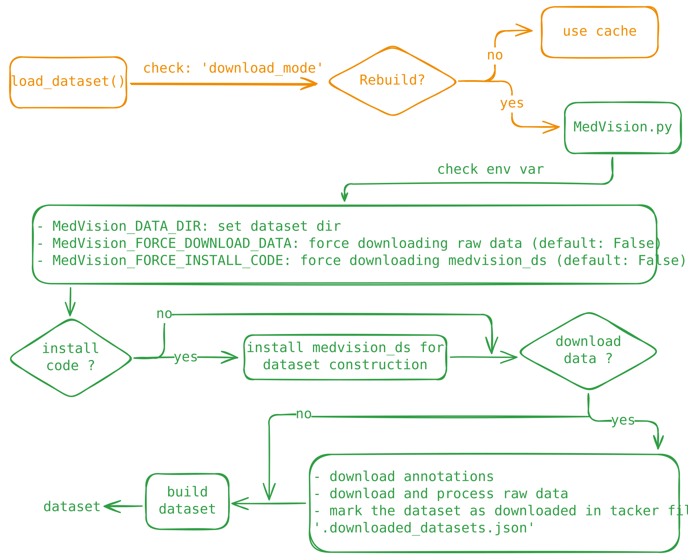

# Dataset concepts

MedVision is a benchmark built for *quantitative* medical image analysis: instead of asking a model to name a finding, it asks the model to measure one, and it scores that measurement against a physically grounded ground truth. This page explains the ideas you need before you load a single sample — where the data comes from, how subsets are named, what the annotations mean, and why every target is expressed in real-world units.



## What MedVision holds

At the data level, MedVision (v1.4.0) consolidates **31 public medical imaging datasets** — including collections such as BraTS24, MSD, and OAIZIB-CM — into a single, uniformly structured resource of **33.2K 3D images** and **12.0 million annotated 2D slices**, carrying — across the three quantitative tasks — **25.7 million single-instance annotations**, or **50.5 million multi-instance annotations** with the per-sample quality/size filters lifted ([what those filters drop](#multi-instance-vs-single-instance-annotations)). For **Box** and **A/D** neither figure counts instances — several boxes of the same target on one slice are one annotation in both. **T/L is the exception**: the multi-instance T/L figure counts every measured *ellipse* on the slice (`summarize_datasets.py:255`), which is why the v1.4.0 landmark total (3,801,540) is also its multi-instance annotation count. The imaging spans five modalities: X-ray (XR), CT, MRI, ultrasound (US), and PET, across many anatomical regions.

Source images are kept as 3D volumes reoriented to RAS+ (a canonical right-anterior-superior axis convention), which makes plane definitions consistent across datasets that were originally stored with different orientations. Because most vision-language models consume 2D images, MedVision does not ship pre-cut slices: the loader slices volumes to 2D on the fly along any of the three anatomical planes — axial, coronal or sagittal — at load time. This keeps the on-disk footprint tied to the volumes themselves (a full copy is around 1 TB) rather than to an exploded set of PNGs.

**Segmentation masks.** Every dataset except Ceph-Biometrics-400 and AFIDs — both landmark-only — ships with segmentation masks: dense manual ground truth drawn by expert annotators, and the source of the label names shown in each task's label map below. To download the image and mask files, load any of a dataset's detection configs — MedVision distributes only the annotations, and the loader fetches and preprocesses the raw imaging into the dataset folder you specify.

:::{note}
MedVision distributes only the annotations. The Hugging Face loader script fetches and preprocesses the raw imaging for you into `MedVision_DATA_DIR`. The end-to-end mechanics are covered in [Loading data](loading.md).
:::

## Datasets vs. data configs

Two vocabulary terms do a lot of work throughout the codebase:

- A **dataset** is one of the 31 upstream sources, referenced by its short name (`BraTS24`, `MSD`, `OAIZIB-CM`, …).
- A **data config** is a named, ready-to-load subset of MedVision. You pass a config name to select exactly which slices and annotations you get.

Config names follow a fixed five-part convention (with one exception, noted below):

```text
{dataset}_{annotation-type}_{task-ID}_{slice}_{split}
```

| Field | Values | Meaning |
| --- | --- | --- |
| `dataset` | e.g. `OAIZIB-CM`, `BraTS24` | which upstream source |
| `annotation-type` | `BoxSize`, `TumorLesionSize`, `BiometricsFromLandmarks`, `MaskSize` | what kind of target (see below) |
| `task-ID` | `Task01`, `Task02`, … | a **local** task index within that dataset, not a global MedVision ID |
| `slice` | `Axial`, `Coronal`, `Sagittal` | slicing plane |
| `split` | `Train`, `Test` | subject-level split |

The one exception: Ceph-Biometrics-400's landmark-biometry configs insert a `Distance` / `Angle`
segment after the annotation type, giving a six-part name — e.g.
`Ceph-Biometrics-400_BiometricsFromLandmarks_Angle_Task01_Sagittal_Test`.

A couple of concrete config names:

```text
OAIZIB-CM_BoxSize_Task01_Axial_Test
BraTS24_TumorLesionSize_Task01_Axial_Train
```

The `task-ID` is per-dataset because a single source can define several image–mask targets; those tasks are declared in the dataset-construction code (`medvision_ds/datasets/<dataset>/preprocess_*.py`), so `Task01` for one dataset is unrelated to `Task01` for another.

## The four annotation types

The `annotation-type` field selects what the model is asked to produce and, correspondingly, which fields each returned sample carries:

- **`BoxSize`** — bounding-box detection. Each sample lists boxes with pixel-space `min_coords` / `max_coords` / `center_coords` / `dimensions`, plus per-box physical `sizes`. This is the annotation behind the Detection task (metrics: IoU, Precision, Recall, F1, SuccessRate).
- **`TumorLesionSize`** — the physical extent of a tumour or lesion, reported as major- and minor-axis measurements **in millimetres**. This backs the Tumour/Lesion size task (metrics: MAE, MRE, nMAE, SuccessRate).
- **`BiometricsFromLandmarks`** — clinical biometrics computed from anatomical landmarks: **angles in degrees and distances in millimetres**. This backs the Angle/Distance task (metrics: MAE, MRE, nMAE, SuccessRate), with a `biometric_profile` carrying the metric type, value, and unit.
- **`MaskSize`** — segmentation-mask area, exposed via a `ROI_area` field alongside pixel and voxel geometry.

Every sample, regardless of type, also carries the geometry needed to interpret it: `image_size_2d`, `pixel_size` (per-axis, 2D), `image_size_3d`, `voxel_size` (per-axis, 3D), and the slice locator (`slice_dim`, `slice_idx`).

## Multi-instance vs single-instance annotations

A benchmark sample is a *(2D slice, target)* pair, counted **per target, not per instance**: several boxes or clusters of the same target on one slice still count as a single annotation. What differs between the two annotation sets is whether the loader's per-sample quality/size filters are applied:

- **Multi-instance** (unfiltered) — every recorded sample is kept, however many instances it has on the slice and whatever their size.
- **Single-instance** (filtered) — a sample is kept only when its target is a single, large-enough instance. The per-task drop rules are:

| Benchmark task | Single-instance drops the sample when… |
|---|---|
| **Box** — detection | the slice has **more than one** box for the target (`len(bounding_boxes) > 1`), **or** its only box is **< 10 px** on either side |
| **T/L** — tumor / lesion size | the target mask has **more than one** connected component on the slice (`n_total_clusters > 1`) — counting **all** components, including ones too small to have been measured (see the note below); v1.0.0 plans lack `n_total_clusters`, so there the fallback is more than one *measured* component (`len(biometric_profile) > 1`) |
| **A/D** — biometrics (angle / distance) | *never dropped* — every angle and distance sample is kept (the loader only splits them by `metric_type`) |
| **MaskSize** — area (not benchmarked) | the mask covers fewer than **200 pixels** on the slice |

:::{note}
**T/L has a second, earlier filter that affects both sets.** When the T/L annotations are generated, an ellipse is fitted to each connected component of the target mask on a slice — but components too small to measure are skipped and never recorded. What "too small" means depends on the annotation version:

- **v1.4.0 (current)** — a component is measured only when its fitted ellipse's **major axis** clears a physical floor: `max(2.0 mm, 2 × the coarser in-plane spacing)` of the plane being measured. This is a *resolution* floor, not a clinical one — it is stated in millimetres because a pixel count is not a physical size: sagittal and coronal slices are reconstructed across the slice axis, so the same pixel count spans very different physical extents on different planes. The ellipse fit itself is additionally guarded against degenerate results (a contour under 5 points, a non-finite fit, a minor axis thinner than one voxel, or a major axis over 1.5× the cluster's own bounding-box diagonal are all rejected).
- **v1.1.0 – v1.3.0** — a raw **pixel-count** threshold: components under **20 pixels** (10 for LIDC-IDRI) were skipped (v1.0.0 used a **200-pixel** threshold, lowered to 20 in v1.1.0), and an `all_within` containment gate additionally discarded well-fitted but *rotated* ellipses.

Removing the containment gate — not the lower floor — accounts for most of the v1.4.0 growth, because it discarded well-fitted but rotated ellipses regardless of size. Replacing the two rules grew T/L **landmarks** 50× (75,840 → 3,801,540 across the 12 T/L datasets) and published **single-instance samples** 20× (47,725 → 966,189); the two differ because the default single-cluster filter still drops multi-cluster slices. See the [v1.4.0 release note](https://huggingface.co/datasets/YongchengYAO/MedVision/blob/main/doc/release-v1.4.0.md) and the [per-dataset impact](statistics.md#v140-regenerated-tl-annotations).

Two consequences, in every version:

- A slice whose components are **all** below the floor is not recorded at all — it appears in **neither** the multi-instance nor the single-instance set.
- A slice with one measured lesion plus a tiny sub-floor satellite **is** recorded (with the satellite unmeasured), but is still dropped from the single-instance set, because `n_total_clusters` counts every component, measured or not.

So the multi-instance set contains every *recorded* sample — not every mask component: sub-floor components carry no measurement in either set.
:::

:::{note}
**Why LIDC-IDRI's legacy threshold (10 px) was safe to use.** *This note applies to annotation versions 1.3.0 and earlier, whose cluster filter was a pixel count; from v1.4.0 the floor is physical (millimetres), so the question below no longer arises in this form.* Oncological imaging has a standard definition of what counts as a "measurable" lesion: RECIST 1.1 requires a lesion to reach at least 10 mm in longest diameter on axial CT to be scored at all. This isn't an arbitrary cutoff — it reflects a lesion needing to span at least twice a typical CT slice thickness before its extent can be reliably read off the image. Anything smaller is classified non-measurable and excluded from tumor response assessment. An annotation pipeline that discards small mask fragments before measuring them should be checked against exactly this line: does it ever discard something a radiologist would have called measurable? For LIDC-IDRI, the answer is no:

- **The geometry rules it out by construction.** A discarded component is at most 9 pixels. Even in the most favorable (compact, roughly square) case, that's about a 3-pixel side — reaching 10 mm would require a pixel size of over 3 mm, far coarser than anything in this dataset.
- **The dataset's actual resolution is nowhere near that coarse.** In-plane pixel spacing across all 1,013 scans ranges from about 0.46 to 0.98 mm, roughly 3–7x finer than the pitch that would be needed for a dropped fragment to reach the measurable threshold.
- **A direct measurement confirms it, with no shape assumptions needed.** Re-running the same connected-component labeling the pipeline uses and measuring every fragment it discards — nearly 30,000 of them across all cases and viewing planes — shows none reaches a 10 mm equivalent diameter. The largest is well under half that size.
- **What gets dropped on the clinically relevant view is smaller still.** On axial slices — the plane RECIST measurements are actually taken on — the largest discarded fragment is under 6 mm, comfortably below the 10 mm floor. The handful of larger-looking fragments only appear when measuring diagonally across reformatted (sagittal/coronal) views, where they're thin partial-volume slivers rather than lesion cross-sections — exactly the kind of view RECIST's slice-thickness rule is designed to exclude from measurement in the first place.
:::

Because the load-time filter only ever removes samples, every single-instance sample is also a multi-instance one: **single-instance ⊆ multi-instance**. The default loader returns the single-instance set; to load the unfiltered set, see [Loading unfiltered (multi-instance) samples](loading.md#loading-unfiltered-multi-instance-samples). Per-version counts for both sets are tabulated in [Dataset versions & statistics](statistics.md#benchmark-annotations-by-version).

:::{warning}
Single-instance (filtered) is the set to use for leaderboard comparison. The multi-instance set is not — MedVision-V0's SFT/RFT training is not optimized for multi-instance detection and measurement.
:::

## Why the targets are physical

The defining property of MedVision is that ground-truth targets are **real-world physical quantities** — millimetres and degrees — not pixel counts. They are derived from the voxel spacing stored in each image's header: a bounding box measured as 40 pixels wide means something only once you multiply by the millimetres-per-pixel of that particular scan. Because the annotations bake in this spacing, a size or distance target is comparable across scanners, resolutions, and datasets, which is exactly what makes the benchmark *quantitative* rather than categorical.

:::{warning}
**Once an image is resized, its pixel size must be updated to match.** The pixel-to-millimetre mapping stated in the prompt is only correct at the resolution the model actually sees, so whenever a model's preprocessing resizes an input, the pixel size has to be rescaled by the same factor — that way `image size × pixel size` still equals the true physical extent, and the model can do the pixel→mm arithmetic itself. A non-square resize scales height and width by different factors, so the update is applied **per axis**. Getting this right is essential for fair scoring; the per-model details are covered when you [add a model](../extending/add-a-model.md).
:::

## Where to go next

- [Loading data](loading.md) — install the loader, set `MedVision_DATA_DIR` and the version env vars, and pull a config with `load_dataset()`.
- [Add a model](../extending/add-a-model.md) — how the pixel-size recomputation is wired into a model's image-processing path.
