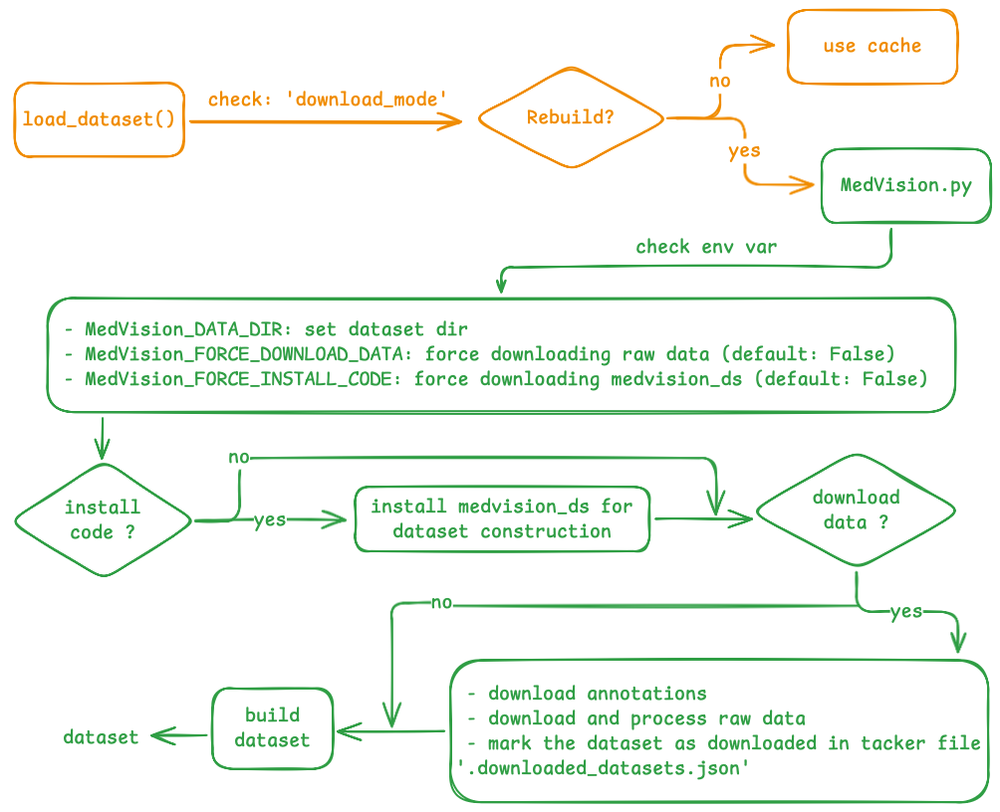

# Dataset concepts

MedVision is a benchmark built for *quantitative* medical image analysis: instead of asking a model to name a finding, it asks the model to measure one, and it scores that measurement against a physically grounded ground truth. This page explains the ideas you need before you load a single sample — where the data comes from, how subsets are named, what the annotations mean, and why every target is expressed in real-world units.



## What MedVision holds

At the data level, MedVision consolidates **22 public medical imaging datasets** — including collections such as BraTS24, MSD, and OAIZIB-CM — into a single, uniformly structured resource of roughly **30.8 million image–annotation pairs**. The imaging spans five modalities: X-ray (XR), CT, MRI, ultrasound (US), and PET, across many anatomical regions.

Source images are kept as **3D volumes reoriented to RAS+** (a canonical right-anterior-superior axis convention), which makes plane definitions consistent across datasets that were originally stored with different orientations. Because most vision-language models consume 2D images, MedVision does not ship pre-cut slices. Instead the loader **slices volumes to 2D on the fly** along any of the three anatomical planes — axial, coronal, or sagittal — at load time. This keeps the on-disk footprint tied to the volumes themselves (the full dataset is around 1 TB) rather than to an exploded set of PNGs.

:::{note}
MedVision distributes only the annotations. The Hugging Face loader script fetches and preprocesses the raw imaging for you into `MedVision_DATA_DIR`. The end-to-end mechanics are covered in [Loading data](loading.md).
:::

## Datasets vs. data configs

Two vocabulary terms do a lot of work throughout the codebase:

- A **dataset** is one of the 22 upstream sources, referenced by its short name (`BraTS24`, `MSD`, `OAIZIB-CM`, …).
- A **data config** is a named, ready-to-load subset of MedVision. You pass a config name to select exactly which slices and annotations you get.

Config names follow a fixed five-part convention:

```text
{dataset}_{annotation-type}_{task-ID}_{slice}_{split}
```

| Field | Values | Meaning |
| --- | --- | --- |
| `dataset` | e.g. `OAIZIB-CM`, `BraTS24` | which upstream source |
| `annotation-type` | `BoxSize`, `TumorLesionSize`, `BiometricsFromLandmarks`, `MaskSize` | what kind of target (see below) |
| `task-ID` | `Task01`, `Task02`, … | a **local** task index within that dataset, not a global MedVision ID |
| `slice` | `Axial`, `Coronal`, `Sagittal` | slicing plane |
| `split` | `Train`, `Test` | subject-level split |

A couple of concrete config names:

```text
OAIZIB-CM_BoxSize_Task01_Axial_Test
BraTS24_TumorLesionSize_Task01_Axial_Train
```

The `task-ID` is per-dataset because a single source can define several image–mask targets; those tasks are declared in the dataset-construction code (`medvision_ds/datasets/<dataset>/preprocess_*.py`), so `Task01` for one dataset is unrelated to `Task01` for another.

## The four annotation types

The `annotation-type` field selects what the model is asked to produce and, correspondingly, which fields each returned sample carries:

- **`BoxSize`** — bounding-box detection. Each sample lists boxes with pixel-space `min_coords` / `max_coords` / `center_coords` / `dimensions`, plus per-box physical `sizes`. This is the annotation behind the Detection task (metrics: IoU, Precision, Recall, F1, SuccessRate).
- **`TumorLesionSize`** — the physical extent of a tumour or lesion, reported as major- and minor-axis measurements **in millimetres**. This backs the Tumour/Lesion size task (metrics: MAE, MRE, nMAE, SuccessRate).
- **`BiometricsFromLandmarks`** — clinical biometrics computed from anatomical landmarks: **angles in degrees and distances in millimetres**. This backs the Angle/Distance task (metrics: MAE, MRE), with a `biometric_profile` carrying the metric type, value, and unit.
- **`MaskSize`** — segmentation-mask area, exposed via a `ROI_area` field alongside pixel and voxel geometry.

Every sample, regardless of type, also carries the geometry needed to interpret it: `image_size_2d`, `pixel_size` (per-axis, 2D), `image_size_3d`, `voxel_size` (per-axis, 3D), and the slice locator (`slice_dim`, `slice_idx`).

## Why the targets are physical

The defining property of MedVision is that ground-truth targets are **real-world physical quantities** — millimetres and degrees — not pixel counts. They are derived from the voxel spacing stored in each image's header: a bounding box measured as 40 pixels wide means something only once you multiply by the millimetres-per-pixel of that particular scan. Because the annotations bake in this spacing, a size or distance target is comparable across scanners, resolutions, and datasets, which is exactly what makes the benchmark *quantitative* rather than categorical.

:::{warning}
Physical targets have a direct consequence for evaluation: the mapping between pixels and millimetres is only valid at the image's native resolution. The moment a model's preprocessing **resizes** an input, the effective per-axis pixel size changes, and it must be recomputed — separately for each axis, since a non-square resize scales height and width differently. Getting this recomputation right is essential for fair scoring; the per-model details are covered when you [add a model](../extending/add-a-model.md).
:::

## Where to go next

- [Loading data](loading.md) — install the loader, set `MedVision_DATA_DIR` and the version env vars, and pull a config with `load_dataset()`.
- [Add a model](../extending/add-a-model.md) — how the pixel-size recomputation is wired into a model's image-processing path.
