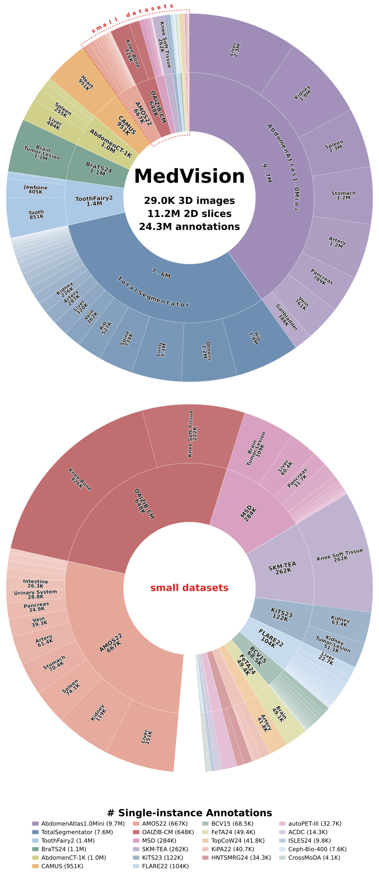
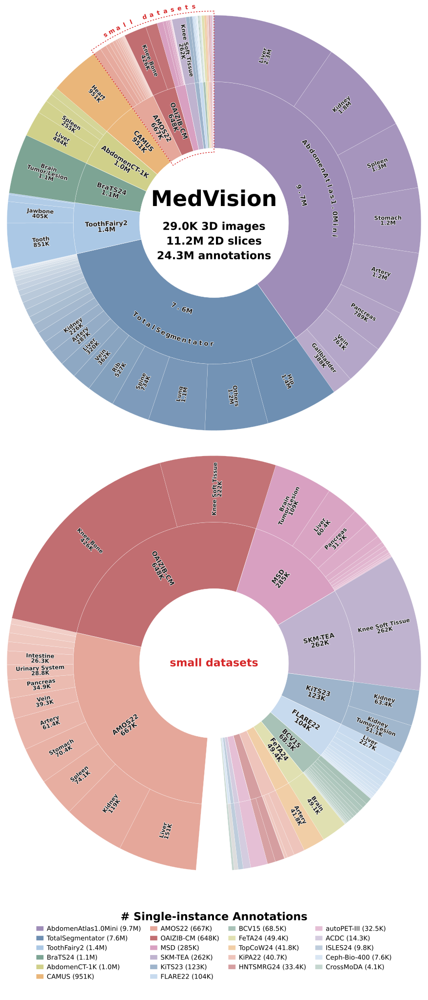

# Dataset versions & statistics

Every MedVision annotation is produced by a versioned *planner* (`1.0.0`, `1.1.0`, `1.1.1`), and the exact set of benchmark samples depends on which planner version you load. This page collects the version guidance, the per-subtask index files, and the aggregate per-dataset statistics you need to know which numbers apply to your run.

For what a *sample* actually is (and why several instances of a target on one slice count once), see [Dataset concepts](concepts.md#multi-instance-vs-single-instance-annotations). For the env var that toggles the sample filter, see [Loading data](loading.md#loading-unfiltered-multi-instance-samples).

:::{important}
**Leaderboard results use annotation v1.0.0.** All published leaderboard numbers are computed on the **v1.0.0** annotations, with ambiguous cases (multi-instance targets) removed during metric calculation as a workaround. For new studies we recommend the **latest** annotation version (currently **v1.1.1**), which is what `MedVision_PLANNER_VERSION=latest` resolves to.
:::

## Subtasks map to dataset subsets

Each benchmark subtask corresponds to a subset of the MedVision dataset. The per-subtask sample sizes are tabulated for every dataset version under [`dataset-info/`](https://github.com/YongchengYAO/MedVision/tree/master/dataset-info):

- [`all_tasks__ds_v1.0.0`](https://github.com/YongchengYAO/MedVision/tree/master/dataset-info/all_tasks__ds_v1.0.0)
- [`all_tasks__ds_v1.1.0`](https://github.com/YongchengYAO/MedVision/tree/master/dataset-info/all_tasks__ds_v1.1.0)
- [`all_tasks__ds_v1.1.1`](https://github.com/YongchengYAO/MedVision/tree/master/dataset-info/all_tasks__ds_v1.1.1)

Because the quantitative tasks require pixel→mm arithmetic, the distribution of pixel sizes (physical spacing) across subtasks is provided in [`pixel_sizes__ds_v1.0.0`](https://github.com/YongchengYAO/MedVision/tree/master/dataset-info/pixel_sizes__ds_v1.0.0).

For the full description of the source datasets, modalities, anatomies, annotation types, and returned fields, see the [Hugging Face dataset repo](https://huggingface.co/datasets/YongchengYAO/MedVision).

## Per-dataset statistics (version-invariant)

The modality / image / slice / segmentation statistics below are the **same for every dataset version** — only the benchmark-annotation counts (Box / T/L / A/D) depend on the planner version, and among those only **T/L** changes. These numbers are computed from the local benchmark plans by [`script/misc/summarize_datasets.sh`](https://github.com/YongchengYAO/MedVision/tree/master/script/misc/summarize_datasets.sh).

The **Seg. annotations** column counts segmentation-mask (`MaskSize`) annotations; these are tracked separately and are **not** part of the Box / T/L / A/D benchmark-annotation counts in the next section.

:::{dropdown} Per-dataset stats — modality, images, slices, segmentation

| Dataset | Modality | 3D Images | 3D Masks | 2D Slices | Seg. annotations |
|---|---|--:|--:|--:|--:|
| ACDC | MRI | 300 | 300 | 43,962 | 94,160 |
| AMOS22 | CT, MRI | 360 | 360 | 251,637 | 1,215,776 |
| AbdomenAtlas1.0Mini | CT | 5,195 | 5,195 | 3,778,805 | 13,770,398 |
| AbdomenCT-1K | CT | 1,000 | 1,000 | 711,155 | 1,549,325 |
| BCV15 | CT | 60 | 60 | 34,472 | 125,870 |
| BraTS24 | MRI | 10,632 | 3,033 | 2,019,118 | 3,767,594 |
| CAMUS | ultrasound | 1,000 | 1,000 | 670,964 | 1,341,433 |
| Ceph-Biometrics-400 | X Ray | 400 | 0 | 7,600 | 0 |
| CrossMoDA | MRI | 105 | 105 | 14,115 | 16,623 |
| FLARE22 | CT | 50 | 50 | 34,235 | 152,954 |
| FeTA24 | MRI | 80 | 80 | 35,776 | 153,599 |
| HNTSMRG24 | MRI | 300 | 300 | 56,078 | 62,424 |
| ISLES24 | MRI | 298 | 149 | 97,228 | 97,228 |
| KiPA22 | CT | 70 | 70 | 29,494 | 74,690 |
| KiTS23 | CT | 489 | 489 | 190,642 | 291,550 |
| MSD | CT, MRI | 3,225 | 1,741 | 791,706 | 1,438,472 |
| OAIZIB-CM | MRI | 507 | 507 | 358,728 | 922,989 |
| SKM-TEA | MRI | 310 | 155 | 173,690 | 475,828 |
| ToothFairy2 | CT | 480 | 480 | 397,531 | 2,131,223 |
| TopCoW24 | CT, MRI | 250 | 250 | 87,953 | 251,901 |
| TotalSegmentator | CT, MRI | 1,844 | 1,844 | 1,091,563 | 16,979,575 |
| autoPET-III | CT, PET | 2,076 | 1,038 | 360,638 | 360,638 |
| **Total (22)** | — | **29,031** | **18,206** | **11,237,090** | **45,274,250** |

:::

## Benchmark annotations by version

The three quantitative tasks — **Box** (detection), **T/L** (tumor/lesion size), and **A/D** (biometrics) — contribute the benchmark-annotation counts. Only **T/L** differs across planner versions; **Box** and **A/D** are identical across all three. The totals below give the single-instance (filtered) and multi-instance (unfiltered) counts summed over all 22 datasets:

| Planner version | Single-instance (filtered) | Multi-instance (unfiltered) |
|---|--:|--:|
| `1.1.1` (default) | 24,279,534 | 45,338,754 |
| `1.1.0` | 24,292,466 | 45,354,786 |
| `1.0.0` (leaderboard) | 24,276,501 | 45,314,742 |

Each per-dataset cell reads `total (Box … · T/L … · A/D …)`, and the donut figures show the same split — the outer ring by dataset, the inner ring by task. The figures and counts are generated from the local benchmark plans by [`script/misc/summarize_datasets.sh`](https://github.com/YongchengYAO/MedVision/tree/master/script/misc/summarize_datasets.sh) (source counts also saved as `dataset_summary_filtered.json` / `dataset_summary_raw.json` under each `dataset-info/datasets_summary_v<version>/`).

:::{dropdown} MedVision v1.1.1 (default) — donut + annotation counts

**Single-instance (filtered)**

{.donut-card}

**Multi-instance (unfiltered)**

{.donut-card}

| Dataset | Single-instance (Box / T/L / A/D) | Multi-instance (Box / T/L / A/D) |
|---|--|--|
| ACDC | 14,271 (Box 14,271) | 94,160 (Box 94,160) |
| AMOS22 | 666,532 (Box 666,532) | 1,215,776 (Box 1,215,776) |
| AbdomenAtlas1.0Mini | 9,748,290 (Box 9,748,290) | 13,770,398 (Box 13,770,398) |
| AbdomenCT-1K | 1,041,588 (Box 1,041,588) | 1,549,325 (Box 1,549,325) |
| BCV15 | 68,543 (Box 68,543) | 125,870 (Box 125,870) |
| BraTS24 | 1,131,404 (Box 1,115,524 · T/L 15,880) | 3,793,777 (Box 3,767,594 · T/L 26,183) |
| CAMUS | 951,370 (Box 951,370) | 1,341,433 (Box 1,341,433) |
| Ceph-Biometrics-400 | 7,600 (A/D 7,600) | 7,600 (A/D 7,600) |
| CrossMoDA | 4,076 (Box 4,076) | 16,623 (Box 16,623) |
| FLARE22 | 104,211 (Box 104,211) | 152,954 (Box 152,954) |
| FeTA24 | 49,412 (Box 49,087 · A/D 325) | 153,924 (Box 153,599 · A/D 325) |
| HNTSMRG24 | 34,301 (Box 32,029 · T/L 2,272) | 65,612 (Box 62,424 · T/L 3,188) |
| ISLES24 | 9,774 (Box 9,774) | 97,228 (Box 97,228) |
| KiPA22 | 40,724 (Box 37,647 · T/L 3,077) | 77,832 (Box 74,690 · T/L 3,142) |
| KiTS23 | 121,539 (Box 114,491 · T/L 7,048) | 299,584 (Box 291,550 · T/L 8,034) |
| MSD | 283,577 (Box 277,451 · T/L 6,126) | 1,451,386 (Box 1,438,472 · T/L 12,914) |
| OAIZIB-CM | 648,048 (Box 648,048) | 922,989 (Box 922,989) |
| SKM-TEA | 262,338 (Box 262,338) | 475,828 (Box 475,828) |
| ToothFairy2 | 1,413,979 (Box 1,413,979) | 2,131,223 (Box 2,131,223) |
| TopCoW24 | 41,829 (Box 41,829) | 251,901 (Box 251,901) |
| TotalSegmentator | 7,603,455 (Box 7,603,455) | 16,979,575 (Box 16,979,575) |
| autoPET-III | 32,673 (Box 31,794 · T/L 879) | 363,756 (Box 360,638 · T/L 3,118) |
| **Total (22)** | **24,279,534** | **45,338,754** |

:::

:::{dropdown} MedVision v1.1.0 — donut + annotation counts

**Single-instance (filtered)**

{.donut-card}

**Multi-instance (unfiltered)**

{.donut-card}

| Dataset | Single-instance (Box / T/L / A/D) | Multi-instance (Box / T/L / A/D) |
|---|--|--|
| ACDC | 14,271 (Box 14,271) | 94,160 (Box 94,160) |
| AMOS22 | 666,532 (Box 666,532) | 1,215,776 (Box 1,215,776) |
| AbdomenAtlas1.0Mini | 9,748,290 (Box 9,748,290) | 13,770,398 (Box 13,770,398) |
| AbdomenCT-1K | 1,041,588 (Box 1,041,588) | 1,549,325 (Box 1,549,325) |
| BCV15 | 68,543 (Box 68,543) | 125,870 (Box 125,870) |
| BraTS24 | 1,134,663 (Box 1,115,524 · T/L 19,139) | 3,797,951 (Box 3,767,594 · T/L 30,357) |
| CAMUS | 951,370 (Box 951,370) | 1,341,433 (Box 1,341,433) |
| Ceph-Biometrics-400 | 7,600 (A/D 7,600) | 7,600 (A/D 7,600) |
| CrossMoDA | 4,076 (Box 4,076) | 16,623 (Box 16,623) |
| FLARE22 | 104,211 (Box 104,211) | 152,954 (Box 152,954) |
| FeTA24 | 49,412 (Box 49,087 · A/D 325) | 153,924 (Box 153,599 · A/D 325) |
| HNTSMRG24 | 35,158 (Box 32,029 · T/L 3,129) | 66,899 (Box 62,424 · T/L 4,475) |
| ISLES24 | 9,774 (Box 9,774) | 97,228 (Box 97,228) |
| KiPA22 | 40,724 (Box 37,647 · T/L 3,077) | 77,832 (Box 74,690 · T/L 3,142) |
| KiTS23 | 126,962 (Box 114,491 · T/L 12,471) | 305,698 (Box 291,550 · T/L 14,148) |
| MSD | 286,603 (Box 277,451 · T/L 9,152) | 1,455,092 (Box 1,438,472 · T/L 16,620) |
| OAIZIB-CM | 648,048 (Box 648,048) | 922,989 (Box 922,989) |
| SKM-TEA | 262,338 (Box 262,338) | 475,828 (Box 475,828) |
| ToothFairy2 | 1,413,979 (Box 1,413,979) | 2,131,223 (Box 2,131,223) |
| TopCoW24 | 41,829 (Box 41,829) | 251,901 (Box 251,901) |
| TotalSegmentator | 7,603,455 (Box 7,603,455) | 16,979,575 (Box 16,979,575) |
| autoPET-III | 33,040 (Box 31,794 · T/L 1,246) | 364,507 (Box 360,638 · T/L 3,869) |
| **Total (22)** | **24,292,466** | **45,354,786** |

:::

:::{dropdown} MedVision v1.0.0 (leaderboard) — donut + annotation counts

**Single-instance (filtered)**

{.donut-card}

**Multi-instance (unfiltered)**

{.donut-card}

| Dataset | Single-instance (Box / T/L / A/D) | Multi-instance (Box / T/L / A/D) |
|---|--|--|
| ACDC | 14,271 (Box 14,271) | 94,160 (Box 94,160) |
| AMOS22 | 666,532 (Box 666,532) | 1,215,776 (Box 1,215,776) |
| AbdomenAtlas1.0Mini | 9,748,290 (Box 9,748,290) | 13,770,398 (Box 13,770,398) |
| AbdomenCT-1K | 1,041,588 (Box 1,041,588) | 1,549,325 (Box 1,549,325) |
| BCV15 | 68,543 (Box 68,543) | 125,870 (Box 125,870) |
| BraTS24 | 1,126,595 (Box 1,115,524 · T/L 11,071) | 3,778,687 (Box 3,767,594 · T/L 11,093) |
| CAMUS | 951,370 (Box 951,370) | 1,341,433 (Box 1,341,433) |
| Ceph-Biometrics-400 | 7,600 (A/D 7,600) | 7,600 (A/D 7,600) |
| CrossMoDA | 4,076 (Box 4,076) | 16,623 (Box 16,623) |
| FLARE22 | 104,211 (Box 104,211) | 152,954 (Box 152,954) |
| FeTA24 | 49,412 (Box 49,087 · A/D 325) | 153,924 (Box 153,599 · A/D 325) |
| HNTSMRG24 | 33,421 (Box 32,029 · T/L 1,392) | 63,840 (Box 62,424 · T/L 1,416) |
| ISLES24 | 9,774 (Box 9,774) | 97,228 (Box 97,228) |
| KiPA22 | 40,742 (Box 37,647 · T/L 3,095) | 77,785 (Box 74,690 · T/L 3,095) |
| KiTS23 | 122,975 (Box 114,491 · T/L 8,484) | 300,090 (Box 291,550 · T/L 8,540) |
| MSD | 284,923 (Box 277,451 · T/L 7,472) | 1,446,146 (Box 1,438,472 · T/L 7,674) |
| OAIZIB-CM | 648,048 (Box 648,048) | 922,989 (Box 922,989) |
| SKM-TEA | 262,338 (Box 262,338) | 475,828 (Box 475,828) |
| ToothFairy2 | 1,413,979 (Box 1,413,979) | 2,131,223 (Box 2,131,223) |
| TopCoW24 | 41,829 (Box 41,829) | 251,901 (Box 251,901) |
| TotalSegmentator | 7,603,455 (Box 7,603,455) | 16,979,575 (Box 16,979,575) |
| autoPET-III | 32,529 (Box 31,794 · T/L 735) | 361,387 (Box 360,638 · T/L 749) |
| **Total (22)** | **24,276,501** | **45,314,742** |

:::

:::{warning}
Multi-instance annotations are **not** for leaderboard comparison. Do not use them to compare models on the leaderboard — the current MedVision-V0 SFT/RFT training is not optimized for multi-instance detection and measurement tasks.
:::
